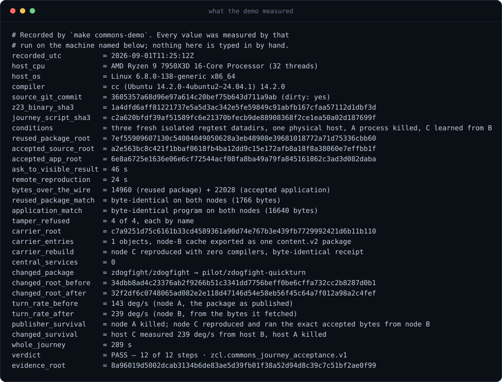
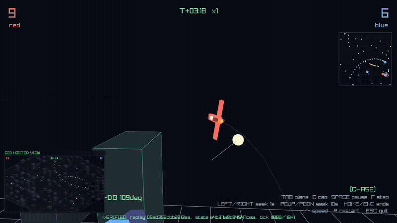

<!-- Copyright 2026 Rhett Creighton. Licensed under Apache-2.0. -->

<p align="center">
  
</p>

<p align="center">
  <a href="LICENSE"></a>
  
  <a href="docs/MVP.md"></a>
  <a href="#start-here"></a>
</p>

# Z23

**Describe software. See it run. Keep the exact version.**

Z23 is a C23-first **sovereign software computer**. Its trusted core is two
things at once:

- a real full node for the 100% proof-of-work ZClassic chain; and
- a peer-to-peer commons where people and AI workers can find, build, verify,
  reproduce, preserve, and improve native C23 software.

The AI is replaceable. The exact source, build history, evidence, wallet keys,
local policy, and software you accepted remain under your control.

```text
YOU
 │
 │  "Make me a private photo diary.
 │   Add tags and a slideshow."
 ▼
Z23 understands the goal
 │
 ├─ finds reusable C23
 ├─ checks exact source, platform, license, capabilities, and tests
 ├─ creates only the missing behavior
 ├─ builds and shows the native application
 └─ records what actually happened
         │
         ▼
YOU accept one exact version
         │
         ▼
another machine reproduces it
         │
         ▼
the original AI, author, host, or registry may disappear
```

> [!IMPORTANT]
> Z23 is **pre-v1**. It is usable for native C23 development and real node
> operation, but do not rely on it as your only mainnet node yet. The acceptance
> target is explicit: someone the project does not know can run Z23 and use it
> for a week without intervention. See [`docs/MVP.md`](docs/MVP.md), or run
> `make mvp`.

---

## 🚀 Start here

### See native C23 behavior without building the full node

The lean GUI build compiles a two-translation-unit application without paying
for the full-node build graph.

```bash
git clone https://github.com/z23c/z23.git
cd z23

make -f Makefile.gui zhello-selftest   # headless, deterministic frame proof
make -f Makefile.gui zhello            # open the native window
```

`zhello` uses the same small C23 application shape on macOS, Windows, and Linux:
a platform-independent painter plus a thin native window driver.

- **macOS:** install Apple's command-line tools with `xcode-select --install`.
  See [`docs/MACOS_GUI_QUICKSTART.md`](docs/MACOS_GUI_QUICKSTART.md).
- **Windows:** use the supported MSYS2 UCRT64 bootstrap. See
  [`docs/WINDOWS.md`](docs/WINDOWS.md).
- **Linux:** the headless self-test needs no display; the windowed run needs a
  graphical desktop.

### Create your own native app

```bash
make new-app NAME=myapp
make -f Makefile.gui myapp-selftest
make -f Makefile.gui myapp
```

Your application lives under `packages/myapp/` as ordinary C23: one public
header, one painter, one driver, one deterministic test, one package manifest.
On macOS, package it as a reproducible `.app`:

```bash
make -f Makefile.gui myapp-app
```

### Build the full Z23 system and run the commons proof

```bash
make doctor
make setup
make -j4 z23
make commons-demo
```

`make commons-demo` starts three fresh isolated nodes on empty temporary
datadirs. It contacts nothing outside your machine. Exit `0` means the complete
declared journey held:

1. ask for useful behavior and reuse C23 already published by another node;
2. build, test, observe, and accept one exact result;
3. fetch and rebuild the exact source on another node; and
4. remove the original publisher and prove a third node can still reproduce and
   run the accepted software.


The physical-host version is:

```bash
make commons-multihost-acceptance
```



For the full-node build, installation, proving parameters, Tor, and production
operation, continue with [`docs/GETTING_STARTED.md`](docs/GETTING_STARTED.md).

---

## 🧭 The product

**DESCRIBE → REUSE → CREATE → SEE → KEEP → SHARE**


- **DESCRIBE** — say what you want the software to do.
- **REUSE** — find the best existing C23 before generating another copy.
- **CREATE** — write only the behavior that is genuinely missing.
- **SEE** — experience the consequence in the real native application.
- **KEEP** — accept one exact version under your own policy.
- **SHARE** — let peers independently fetch, verify, reproduce, and preserve it.

**SEE is the product.** Roots, manifests, ontologies, queues, proofs, and the
blockchain are supporting machinery. The decisive moment is the software doing
what you requested on your screen before anything is published.

---

## 📖 Software is behavior over time

A useful software request is naturally story-shaped:

```text
🌌 Universe  = what entities, rules, code, and assets exist
🧠 Context   = which assumptions, policy, platform, and observer apply
🎬 Scene     = the current bounded state
🎭 Entity    = something with stable identity whose state can change
➡️ Action    = a proposed state transition
📍 Event     = a transition that was actually observed
📖 Story     = a causal graph of events
📷 View      = what a human, agent, test, or camera sees
```

Z23's north star is to compile that meaningful description into small, fast,
testable native C23:

```text
human description
       ↓
bounded story / goal model
       ↓
exact code and evidence navigation
       ↓
reuse plan
       ↓
generated or edited C23
       ↓
native behavior
       ↓
observation + receipt
       ↓
local human acceptance
```

This is a **direction, not an inflated completion claim**. Today the repository
already has rooted source universes and contexts, typed ontology objects,
immutable signed events, code navigation, exact build actions, native app
templates, and proof receipts. A unified StoryGraph-to-C23 compiler is still
being built.

---

## ⚙️ How Z23 works

```text
                         HUMAN GOAL
                              │
                              ▼
                 ┌────────────────────────┐
                 │  Z23 CODE NAVIGATOR    │
                 │                        │
                 │ exact symbols          │
                 │ ontology + contexts    │
                 │ lexical / BM25 ranking │
                 │ graph/model hints      │
                 └───────────┬────────────┘
                             │ candidates
                             ▼
                 ┌────────────────────────┐
                 │  REUSE PLAN            │
                 │                        │
                 │ packages + APIs        │
                 │ platform + license     │
                 │ capabilities + tests   │
                 │ missing behavior only  │
                 └───────────┬────────────┘
                             │
                             ▼
                 ┌────────────────────────┐
                 │  C23 BUILD + PROOF     │
                 │                        │
                 │ incremental objects    │
                 │ bounded execution      │
                 │ behavior probes        │
                 │ exact child receipts   │
                 └───────────┬────────────┘
                             │
                             ▼
                       NATIVE APP
                             │
                     human sees result
                             │
                             ▼
                    EXACT LOCAL ACCEPTANCE
                             │
              ┌──────────────┴──────────────┐
              ▼                             ▼
      content-addressed peers        optional ZCL anchor
      fetch missing objects          ordering / payment
```

The system deliberately separates five different things:

```text
AI proposal
    ≠
search relevance
    ≠
logical claim
    ≠
observed behavior
    ≠
local authority
```

An LLM may propose a change. A ranker may say where to look. An ontology may
state what follows under an explicit context. A compiler or test may observe one
exact action. Only the local node and human decide what to accept.

---

## 🧠 Intelligence without surrendering authority

Z23 combines several kinds of intelligence, each with a limited job:

| Layer | What it does | What it cannot do |
| --- | --- | --- |
| **LLM worker** | Interprets goals, proposes code, explains results | Grant itself authority or establish truth |
| **Exact navigation** | Finds symbols, definitions, packages, capabilities, and required tests | Prove runtime behavior |
| **Ontology and logic** | Binds typed claims to explicit universes, contexts, coverage, and evidence | Turn missing evidence into certainty |
| **Lexical/BM25 ranking** | Orders likely relevant files for a human goal | Override exact identity or policy |
| **Vector hints** | Suggest semantically similar concepts | Prove identity, safety, completeness, or permission |
| **Compiler and tests** | Observe one exact build or behavior | Decide whether the human wants the result |
| **Local node** | Applies local policy, protects keys, accepts or refuses | Force another node to agree |
| **ZClassic chain** | Supplies public ordering, payments, names, and optional anchors | Prove software correctness or authorize execution |

The ontology evaluator can preserve five honest outcomes:

```text
PROVED
DISPROVED
BOTH
UNKNOWN
INCOMPLETE
```

A contradiction does not become arbitrary truth. Missing coverage does not
become a pass. Model hints never replace mandatory evidence.

---

## 📈 Why the architecture can scale

A billion-line corpus is useful only if an ordinary task does **not** require an
agent to read a billion lines.

```text
normal repository model:

task cost ≈ total repository size
           × repeated scans
           × repeated builds
           × repeated tests

Z23 target:

task cost ≈ relevant closure
           + genuinely missing objects
           + genuinely new proof
```

| Technique | Scaling advantage |
| --- | --- |
| **Content-addressed source and artifacts** | Identical bytes have one identity; peers request only missing objects |
| **Rooted source universes** | Every answer names the exact corpus and generation it describes |
| **Contexts and provenance** | A fact can be invalidated when its support changes without relearning everything |
| **Code and dependency graphs** | Agents follow the affected subgraph instead of scanning the entire corpus |
| **Hybrid retrieval** | Exact filters narrow the space; lexical, graph, and model hints rank what remains |
| **Impact-selected proofs** | A small edit runs its mandatory closure instead of every unrelated test |
| **Compile epochs and object reuse** | Unchanged translation units and toolchain-identical outputs are reused |
| **Exact action roots and receipts** | Two agents asking for the same action can share one verified result |
| **Independent reproduction** | A result survives the original machine, AI vendor, author, and registry |
| **Duplicate detection and evidence** | The corpus can grow in useful behavior faster than it grows in unique complexity |

The desired compounding law is:

```text
MORE AGENTS
    +
MORE SOFTWARE
    +
MORE EVIDENCE

should produce

LESS NEW CODE PER FEATURE
LESS CONTEXT PER TASK
LESS DUPLICATE BUILD/TEST WORK
FASTER VISIBLE RESULTS
BETTER FUTURE SOFTWARE
```

---

## 👤 Who is the “self”?

Z23 does not create one central super-user. It separates sovereignty from shared
intelligence:

```text
👤 HUMAN
goals, values, final acceptance
       │
       ▼
🖥️ FULL-NODE SELF
keys, policy, memory, accepted software
       │
       ▼
🌐 SWARM
shared discovery, source, experiments, and evidence
       │
       ▼
⛓️ ZCLASSIC
shared public ordering and settlement
```

AI workers move through these layers temporarily.

- The **human** supplies purpose.
- The **full node** is the sovereign self: it holds keys, policy, local memory,
  and the exact lineage of accepted software.
- The **swarm** is a collective knowledge system, not a collective ruler.
- The **chain** is shared public history, not a mind and not a software judge.

The principle is:

> **Shared intelligence without shared sovereignty.**

---

## ✅ What exists today

| Area | Current state |
| --- | --- |
| **Native C23 apps** | `zhello` and `ball` use the lean GUI path, native windows, deterministic headless frame tests, and small readable package shapes. macOS can produce reproducible `.app` bundles. |
| **Full node** | A real ZClassic node with consensus validation, wallet custody, P2P, RPC, databases, explorer/API surfaces, and optional embedded Tor. The default build uses the Tor stub; `make tor-full` builds the real embedded onion service. |
| **C23 Commons** | The complete local describe/reuse/build/accept/fetch/reproduce/serve journey runs through `make commons-demo`; multihost acceptance takes the original publisher offline. Open peer transport remains under hardening. |
| **Code intelligence** | Native commands expose the current code map, groups, files, symbols, capabilities, provenance, impact, and focused tests. Rooted ontology and bounded logical evaluation exist. Literal and BM25 retrieval are measured in the development benchmark; graph/vector expansion is active work. |
| **Build and proof fabric** | Source-bound compile epochs, incremental object reuse, a resident content-addressed proof queue, exact proof-child action identities, structured refusals, receipts, and accepted-output cache foundations exist. |
| **Story-to-software layer** | The underlying identity, context, event, action, and evidence pieces exist; the unified story model and compiler are not yet a shipped user surface. |
| **Acceptance** | The project is pre-v1. `make mvp` names full PASS, partial proxy evidence, and BLOCKED prerequisites without silently collapsing them. |

### Platform lanes

| Platform | Current supported shape |
| --- | --- |
| **Linux x86-64** | Primary full-node, development, proof, and service lane |
| **macOS arm64** | Native node, native GUI apps, focused acceptance, packaged runtime, and reproducible `.app`; some Linux-only confinement, hot-activation, and snapshot capabilities remain unavailable |
| **Windows x86-64** | Native GCC/Clang C23 and Win32 build/acceptance under MSYS2 UCRT64; WSL2 is the complete full-node lane today; native agent confinement and some operations remain unavailable |
| **Other targets** | Portability work is evidence-driven; do not infer runtime support from a cross-compile |

Run the platform's own acceptance before making a support claim:

```bash
make macos-acceptance
make windows-acceptance
```

A MinGW cross-link or Wine run is not native Windows runtime evidence. A Linux
build is not macOS evidence. Z23 names those distinctions instead of hiding
them.

---

## 🔎 Build C23 without guessing

Ask the checkout what already exists before writing another copy:

```bash
build/bin/z23 code guide
build/bin/z23 code have --input='{"text":"bounded parser"}'
build/bin/z23 code map
build/bin/z23 code group lib/ontology
build/bin/z23 code file lib/ontology/include/ontology/ontology.h
build/bin/z23 code capsule zcl_ontology_evaluate_formula_v1
build/bin/z23 code provenance relations zcl_ontology_evaluate_formula_v1
build/bin/z23 code impact lib/ontology/src/ontology_formula.c
build/bin/z23 code tests lib/ontology/src/ontology_formula.c
build/bin/z23 discover schema code.have --side=input
```

The intended development loop is:

```text
goal
 ↓
find existing behavior
 ↓
inspect exact provenance and capability boundaries
 ↓
edit the smallest relevant files
 ↓
ask Z23 for the mandatory proof groups
 ↓
run the exact proof
 ↓
see the result
```

Run the returned focused group, then the fast defensive checks:

```bash
make -j"$(getconf _NPROCESSORS_ONLN)" t-fast-exact ONLY=<exact-group>
make lint-fast
```

For model-neutral development rules, worktree ownership, exact receipts, and
push admission, read [`docs/DEVELOPING.md`](docs/DEVELOPING.md) and
[`AGENTS.md`](AGENTS.md).

---

## 🌐 The C23 Commons

A package name and semantic version are labels. Exact identity is a content
root.

```text
author creates exact source
        ↓
local node derives package and recipe roots
        ↓
bounded build/test produces receipts
        ↓
human accepts one exact release
        ↓
peers announce availability
        ↓
another node fetches inert bytes
        ↓
that node rebuilds and verifies independently
```

The rules are intentionally strict:

```text
FETCH
  ≠ BUILD

BUILD
  ≠ INSTALL

SIGNATURE
  ≠ CORRECTNESS

RECEIPT
  ≠ UNIVERSAL SAFETY

CHAIN ANCHOR
  ≠ EXECUTION AUTHORITY
```

Every receiver applies its own policy. No central registry, package judge, AI
vendor, scheduler, or signer has a permanent privileged role.

Start with:

```bash
build/bin/z23 zcode guide
build/bin/z23 zcode package guide
```

Then follow [`docs/C23_COMMONS_QUICKSTART.md`](docs/C23_COMMONS_QUICKSTART.md).

---

## ⛓️ Why ZClassic is part of the same product

Z23 keeps source, builds, tests, and large artifacts off-chain, where they
belong. The ZClassic proof-of-work chain is useful for the things a public chain
is good at:

```text
ON CHAIN
├─ durable ordering
├─ optional payments and bounties
├─ names and ownership events
└─ compact release or evidence anchors

OFF CHAIN
├─ source trees
├─ build inputs and outputs
├─ tests and observations
├─ ontology/index shards
└─ native applications
```

Proof of work answers which public history has accumulated the accepted work.
It does not answer whether a program is correct.

A chain record therefore never grants package acceptance, wallet authority,
installation, publication, or execution. The full node validates the chain; the
local software system validates software; the human decides what to keep.

---

## 🎮 The game on the cover

Every good software box should show the toy.

`zdogace` is a real-time 3D dogfight: two teams of AI pilots over a neon grid
city. The replay and state roots shown by the HUD are re-derived from the same
deterministic simulation discipline used elsewhere in Z23.



The game is an ordinary C23 application assembled from reusable pieces: arena,
flight model, rendering, and pilots.

> *“Make the aircraft turn faster.”*
> *“Add a blue engine trail.”*
> *“Make these enemies cooperate.”*
> *“Add a building I can enter.”*

The destination is that requests like these become small changes to a shared,
understood, reproducible software world—not another disposable codebase.

---

## Principles that do not bend

1. **The human remains the authority.** AI proposes; the human accepts.
2. **Reuse before create.** Search the commons before generating another copy.
3. **See the consequence.** A visible behavior matters more than a pile of
   manifests.
4. **Exact identity beats names.** Source, actions, artifacts, and evidence are
   content-addressed.
5. **Model hints are not proof.** Similarity may rank candidates; it cannot
   establish truth or skip mandatory tests.
6. **Fetch is inert.** Receiving bytes never grants permission to build, run,
   install, sign, spend, or deploy.
7. **Verify locally.** Every node re-derives what it accepts under its own
   policy.
8. **No privileged coordinator.** Shared intelligence must not require shared
   sovereignty.
9. **C23 source first.** Prefer small, fast, portable native software with
   explicit dependencies.
10. **Free reuse first.** Copyable source remains free; optional payment belongs
    where real scarcity remains—compute, verification, storage, hosting, or
    human work.
11. **The blockchain yields no software authority.** It can order and settle;
    it cannot certify correctness.
12. **Consensus and wallet safety preempt background work.** Indexing, agents,
    builds, and proofs may not impair the full node.

---

## 🧭 Near-term roadmap

The current ordered mission is in
[`docs/work/FORWARD_PLAN.md`](docs/work/FORWARD_PLAN.md). The next product
proofs are:

1. **Finish the full-node V1 acceptance gates.** Real cold sync, live store
   delivery, sovereign soak, and exact parity remain first-class work.
2. **Measure the agent loop.** Record files read, context bytes/tokens, tool
   calls, retries, compiler invocations, cache hits, proof latency, and
   prompt-to-visible behavior on a frozen real-task corpus.
3. **Make reuse-before-create automatic.** Combine exact ontology, platform,
   license, capability, and evidence filters with measured lexical, graph, and
   model-hint ranking.
4. **Build the story-to-C23 layer.** Represent entities, scenes, actions,
   events, causal relationships, views, and invariants without creating a
   second truth or authority system.
5. **Complete the Windows and macOS golden journeys.** From a fresh user account:
   setup, create, develop, see, ship, and reproduce a native C23 application
   with very few visible steps.
6. **Prove cross-machine reuse.** An independently verified action should reuse
   exact source, output, and proof without repeating identical work; the
   original publisher should be allowed to disappear.
7. **Scale only after local value is measured.** Prove 1M, 10M, 100M, and
   eventually 1B-line indexed fixtures while task context stays small and node
   responsiveness remains intact.

Token economics remain simulation-only and do not displace these proofs.

---

## Documentation

| Start here | Document |
| --- | --- |
| **Build and run Z23** | [`docs/GETTING_STARTED.md`](docs/GETTING_STARTED.md) |
| **Create a native macOS app** | [`docs/MACOS_GUI_QUICKSTART.md`](docs/MACOS_GUI_QUICKSTART.md) |
| **Develop on Windows** | [`docs/WINDOWS.md`](docs/WINDOWS.md) |
| **Use the C23 Commons** | [`docs/C23_COMMONS_QUICKSTART.md`](docs/C23_COMMONS_QUICKSTART.md) |
| **Agent and contributor entry point** | [`AGENTS.md`](AGENTS.md) |
| **Development and proof workflow** | [`docs/DEVELOPING.md`](docs/DEVELOPING.md) |
| **Security and integrity model** | [`docs/SECURITY_AND_INTEGRITY.md`](docs/SECURITY_AND_INTEGRITY.md) |
| **Full-node architecture north star** | [`docs/ARCHITECTURE_NORTH_STAR.md`](docs/ARCHITECTURE_NORTH_STAR.md) |
| **Codebase map** | [`docs/CODEBASE_MAP.md`](docs/CODEBASE_MAP.md) |
| **Generated native API reference** | [`docs/API_REFERENCE.md`](docs/API_REFERENCE.md) |
| **Exact capability inventory** | [`docs/CAPABILITY_INVENTORY.jsonl`](docs/CAPABILITY_INVENTORY.jsonl) |
| **Current ordered mission** | [`docs/work/FORWARD_PLAN.md`](docs/work/FORWARD_PLAN.md) |
| **LLM-first app platform checklist** | [`docs/work/LLM-C23-APP-PLATFORM-CHECKLIST.md`](docs/work/LLM-C23-APP-PLATFORM-CHECKLIST.md) |
| **Pre-v1 acceptance criteria** | [`docs/MVP.md`](docs/MVP.md) |
| **Maintainer-host live state** | [`docs/HANDOFF.md`](docs/HANDOFF.md) |

The live native command surface is self-describing:

```bash
build/bin/z23 discover help
build/bin/z23 discover describe <command>
build/bin/z23 status
```


---

## License

Z23 is licensed under the [Apache License 2.0](LICENSE).

The name is the chain and the language: **ZClassic + C23**.
