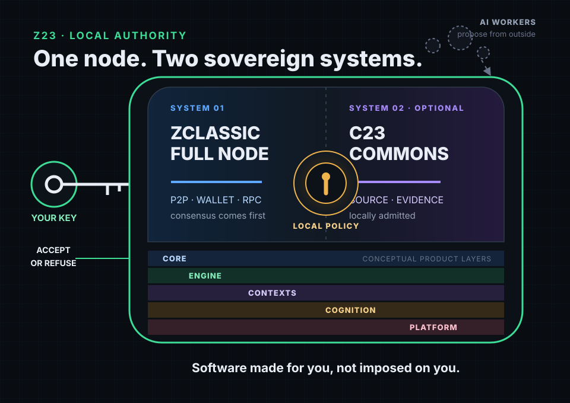
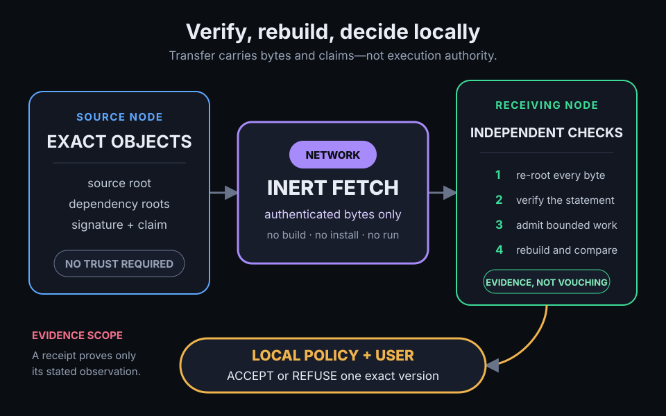
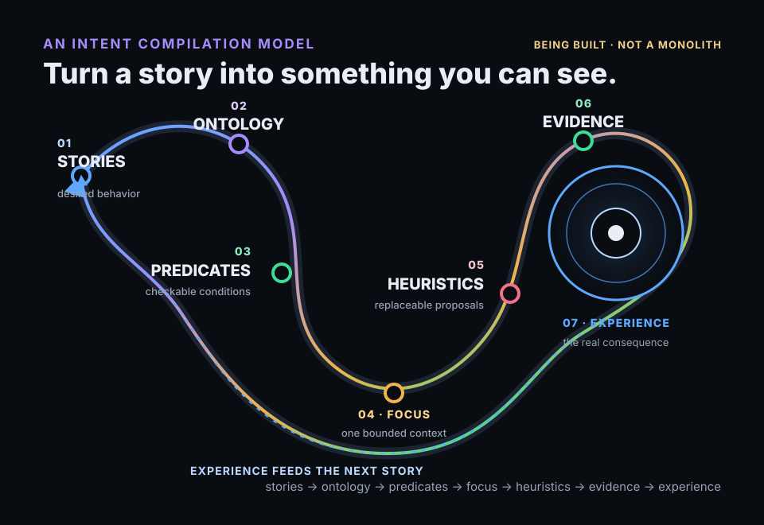

<!-- Copyright 2026 Rhett Creighton. Licensed under Apache-2.0. -->

# Z23

**Software made for you, not imposed on you.**

Z23 is one C23 binary with two sovereign systems: a ZClassic full node and an
optional commons for creating, verifying, reproducing, and preserving C23
software. Both answer to the person running the node—not to an AI vendor, a
package registry, or a hosted service.

> **Status: pre-v1.** The full-node implementation and Commons primitives are
> real, but the complete [public-node acceptance contract](docs/MVP.md) and
> multihost Commons Alpha journey are not yet complete. Z23 is software to
> inspect and test, not a promise that those remaining gates have passed.



**Public start here: [Get started →](docs/GETTING_STARTED.md)**

## From an idea to something you can see

The product journey is deliberately human-sized:

**DESCRIBE → REUSE → CREATE → SEE → KEEP → SHARE**

Describe the behavior you want. Reuse existing C23 before creating what is
missing. Build and test it, then **see the real consequence** before deciding
whether to keep an exact version. Sharing comes last.


`zhello` is the smallest prompt-to-pixel example: a reusable painter plus a
native window. `zdemo` shows the same package shape after customization. Their
headless modes render the real frames and check deterministic digests; their
windowed modes put the consequence on screen.

```bash
make zhello-selftest
make zdemo ZDEMO_ARGS=--frames=2
```

That vignette is small on purpose. The larger goal is the same: shorten the
distance between an intention and observable behavior without hiding which
source, proof, or version produced it.

## One binary, two sovereign systems

**The full node — available today.** Z23 is a C23 implementation of a ZClassic
full node with P2P, transparent and shielded wallet state, RPC, and explorer
surfaces. Builds link the embedded Tor onion service when its vendored archive
is present. Consensus compatibility with `zclassicd` is the inviolable target;
fresh full-history parity, cold-sync, and reliability acceptance remain open
pre-v1 gates.

**The C23 Commons — optional and developing.** The tree has content-addressed
source and package objects, authenticated inert fetch, bounded build/test work,
typed discovery, exact roots, scoped evidence and receipts, reproduction
primitives, and local policy. Fetching bytes does not authorize building them;
building does not authorize installation, execution, or deployment. The
blockchain always has priority over package work.

The systems complement one another without sharing authority: the node
provides durable peer-to-peer infrastructure, while every operator decides
locally what software and evidence to accept.

## Replaceable workers, durable results

AI workers may search, propose, build, and test. They do not become a source of
truth. Z23 is designed to preserve the things another machine can check:
content roots, signatures, dependency graphs, bounded actions, receipts, and
reproduction results.



A hash identifies exact bytes. A signature identifies the key that made a
statement. A receipt records one bound observation. None of them alone proves
that arbitrary code is safe, correct, or useful. Acceptance remains a local
human and machine-policy decision about one exact version.

The intended durability test is simple: the original worker, publisher,
registry, or company can disappear, and the accepted source and evidence can
still be independently checked and reproduced.

## The intent compiler Z23 is building

Z23 is assembling existing primitives into a compilation model for intent:

**stories → ontology → predicates → focus → heuristics → evidence → experience**



Stories capture desired behavior. Ontology gives the domain stable names.
Predicates turn expectations into checkable conditions. Focus selects bounded
context. Heuristics help replaceable workers propose a change. Evidence binds
what was actually observed. Experience is the consequence the user sees—and
it informs the next story.

This is **direction, not a claim of a finished monolithic compiler**.
StoryGraph, ontology, focus, evidence, and typed discovery primitives exist in
the tree today; the complete seven-stage journey is still being assembled and
accepted.

## Architecture you can read at a glance

The five layers in the hero are also the physical source tree:

```text
core/                       sealed consensus, math, crypto, primitives, proofs
engine/                     composition, execution, and the one-writer reducer
  reducer/                  the only authoritative chain-state advancement room
contexts/                   feature-first product rooms
  wallet/services/...       feature + role + purpose in one path
  explorer/...
  naming/...
  messaging/...
  market/...
  commons/...
cognition/                  stories, ontology, focus, evidence, experience
platform/
  ports/                     what the system needs from the outside world
  adapters/                  how an OS or infrastructure provides it
tests/                      the canonical test harness and specifications
tools/                      developer and operator tooling
```

Reusable modules live beneath the authority that owns them—for example,
`core/modules/validation`, `contexts/wallet/modules/keys`, and
`cognition/modules/ontology`. Product behavior stays with its feature instead
of being scattered across global shape folders. The build rejects an unknown
room, legacy root, duplicate module owner, module-manifest mismatch, or reducer
path outside `engine/reducer`.

Ask the binary for the generated view rather than memorizing the tree:

```bash
build/bin/z23 code map
build/bin/z23 code context-map
build/bin/z23 code room engine/reducer/services/src/reducer_ingest_service.c
```

## Build and ask the binary

```bash
git clone https://github.com/z23c/z23.git
cd z23
make setup
make -j"$(getconf _NPROCESSORS_ONLN)" z23
build/bin/z23 discover help
build/bin/z23 zcode guide
```

The native command registry is generated from the running program. Descend
with `discover help <path>`, search with `discover search <query>`, and inspect
a leaf's exact keys with `discover schema <leaf>`. Once a node is running,
`build/bin/z23 status` reports readiness and one next action. If sync stops,
use `build/bin/z23 core sync diagnose`; inspect bounded diagnostics with
`build/bin/z23 ops logs --pattern='<regex>'`.

Contributors can use `make dev-bin`, then ask `code tests <path>` for the
returned registered parallel group instead of guessing which proof to run.

## Go deeper

- **Use the node:** [Getting Started](docs/GETTING_STARTED.md), [C23 Commons Quickstart](docs/C23_COMMONS_QUICKSTART.md), [MVP acceptance](docs/MVP.md)
- **Understand the system:** [How the Node Works](docs/HOW_THE_NODE_WORKS.md), [Framework](docs/FRAMEWORK.md), [API Reference](docs/API_REFERENCE.md)
- **Build with it:** [Developing](docs/DEVELOPING.md), [Codebase Map](docs/CODEBASE_MAP.md), [Forward Plan](docs/work/FORWARD_PLAN.md)
- **License:** [Apache-2.0](LICENSE)

Z23's north star is useful software that remains under the user's control:
exact, inspectable, reproducible, and usable without asking a vanished
intermediary for permission.
