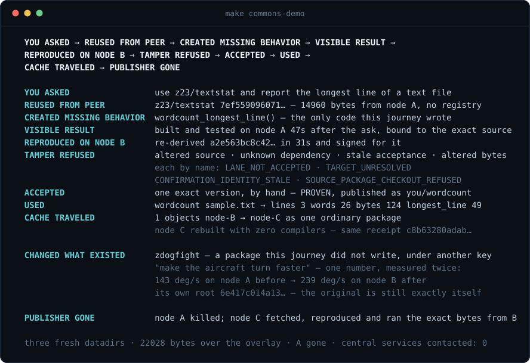
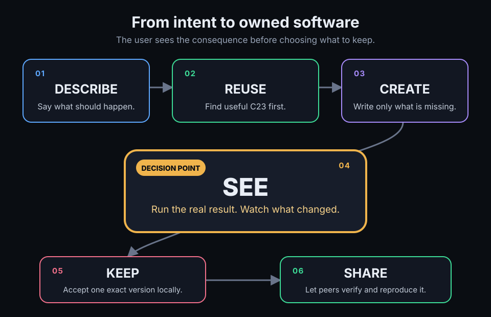
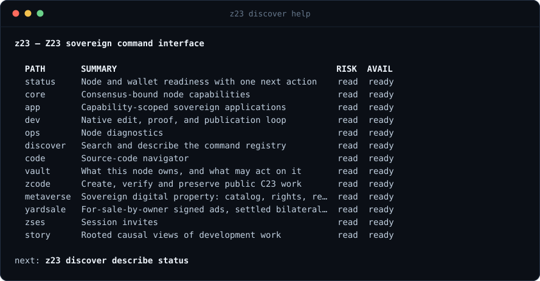

<p align="center">
  
</p>

<p align="center">
  <a href="LICENSE"></a>
  
  <a href="docs/MVP.md"></a>
  <a href="#try-it"></a>
</p>

# Z23

**A sovereign, peer-to-peer network for creating, owning and preserving
software.**

Z23 turns the 100% proof-of-work ZClassic network into a global commons of
reusable C23 software. Describe what you want. Your node searches the commons,
creates only what is missing, builds and verifies the result locally, and lets
you keep the exact version you chose.

This is not simply an AI agent changing code in one repository. Source is
content-addressed, releases can be independently reproduced, distribution needs
no central registry, and the original creator can disappear without taking the
software with them. AI workers are replaceable; the network, exact source
history and user ownership remain.

ZClassic provides decentralized payments, durable ordering, names and
cryptographic anchors. Every node keeps its own keys, policy, software and
authority.

**Software made for you, owned by you and preserved by the network—not rented
from a platform.**

---

## Status

| Layer | Where it stands |
| --- | --- |
| **Full node** | Live. One self-contained C23 binary validates the proof-of-work chain, holds wallet custody behind local keys, and serves its own explorer and API over its persistent Tor onion address. |
| **Onion mesh** | Hardening. Independent fleet nodes publish heartbeats to a shared blackboard while a fail-closed referee dials each one through its onion from a fresh datadir — a box counts only when a stranger completes a real handshake at tip height. Cross-node header repair has already run peer to peer. |
| **C23 Commons** | Built, transport-gated. The full loop — describe, reuse, build, accept, fetch, reproduce, serve — runs locally today via `make commons-demo`; the peer-to-peer swarm opens over mesh transport once that transport proves itself. |
| **Acceptance** | Honest by construction. [`make mvp`](docs/MVP.md) prints PASS only after observing the whole declared criterion; anything unavailable is named BLOCKED, never silently green. |

---

## Try it

```bash
git clone https://github.com/z23c/z23
cd z23
make -j"$(nproc)"
make commons-demo
```

Three fresh nodes start on your machine with empty datadirs. Nothing outside
your machine is contacted, and exit 0 means every step below held — each one
asserts its own promise and stops at the first that does not.

- Ask for software behavior.
- Reuse C23 from another node.
- Build and accept an exact result.
- Another node fetches it and reproduces it peer to peer.
- Then do all of that again to software that already existed, written by
  somebody else — and measure the behavior you asked to change: before on the
  node that published it, after on the node that fetched and rebuilt it.
- Kill the original publisher. A third node still fetches, reproduces, and
  runs those exact bytes from whoever still holds them.

Reproduce means what it sounds like: the second node re-derives the identical
source from content addresses it verified itself, then builds a byte-identical
program. Altered source, an unknown dependency and a stale acceptance are each
refused by name rather than by silence, so the demo cannot print a happy summary
over a failure.



The same journey with B and C on separate physical hosts — the publisher's
machine itself gone — is `make commons-multihost-acceptance`.

---

## The flow

**DESCRIBE → REUSE → CREATE → SEE → KEEP → SHARE**



- **DESCRIBE** — say what you want the software to do, in your own words.
- **REUSE** — Z23 looks for C23 in the commons that already does part of it.
- **CREATE** — only the missing behavior is written, built and tested.
- **SEE** — you experience the changed application before anything is published.
- **KEEP** — you accept one exact version, by hand, and it stays yours.
- **SHARE** — peers fetch that exact source, reproduce it, and preserve it.

SEE is what the rest is in service of. Packages, roots and publication are
machinery; the moment that matters is the application doing what you asked, on
your screen, before anyone has published anything.

---

## The flagship


The flagship is an application you are actually using. Fly it. Ask for a change.
See the new behavior. Keep that exact version. Share it peer to peer.

> *"Make the aircraft turn faster."*
> *"Add a blue engine trail."*
> *"Make these enemies cooperate."*
> *"Add a new building I can enter."*

---

## Principles that do not bend

- **C23 source first.** Small, fast, portable native software.
- **Permissive open source.** Public commons releases are author-signed and
  carry an allowlisted permissive license; your node refuses to announce or
  serve anything that does not verify. See
  [P2P source hosting](docs/P2P_SOURCE_HOSTING.md).
- **Local verification.** Your machine re-derives what it was told, from content
  addresses it checked itself. Nothing is accepted because a server said so.
- **No privileged coordinator.** Discovery is peer to peer; no central registry
  is required, and no node holds a position the others cannot.
- **Free reuse first, payment only where scarcity remains.** Copying source
  costs nothing and stays free. Compute, verification, storage and hosting are
  real costs, and those are what ZCL is for.

---

## The chain

The same binary is a ZClassic full node. The chain gives the commons durable
ordering, payments, names and anchors, while application source and builds stay
off-chain where they belong — a blockchain is a terrible place to put a source
tree and a good place to agree on what happened first. The development loop
above does not wait on it: you can run the whole flow before your node has
caught up to the tip.

---

## Run the node

```bash
build/bin/z23 status
build/bin/z23 core sync diagnose
build/bin/z23 ops logs
```

Every command is a leaf of the native command registry, so nothing here has to
be memorised — `build/bin/z23 discover help` prints the live surface, and
`build/bin/z23 discover describe <leaf>` prints one command's typed contract.

Nodes meet each other over Tor onion services, so a node behind any NAT can
dial and be dialed without port forwarding:

```bash
# join an operator-directed peer (onion endpoint of the peer you trust)
build/bin/z23 zses invite accept --invite=<json>
build/bin/z23 ops mesh join --endpoint=<host>.onion:<port> --input='{"confirm":true}'
build/bin/z23 ops mesh join_status        # did the peer land? honest verdict
```

Onion identities persist in your datadir; the same node keeps the same
address across restarts.



For development, `make dev-bin` builds the faster development binary and
`make t-fast ONLY=<group>` runs one of the registered parallel groups.

---

## Go deeper

| | |
| --- | --- |
| **Public start here** | [Getting started](docs/GETTING_STARTED.md) |
| Agent entry point | [AGENTS.md](AGENTS.md) |
| The commons | [C23 Commons quickstart](docs/C23_COMMONS_QUICKSTART.md) |
| Verification | [Security and integrity](docs/SECURITY_AND_INTEGRITY.md) |
| Design | [Architecture north star](docs/ARCHITECTURE_NORTH_STAR.md) |
| Source map | [Codebase map](docs/CODEBASE_MAP.md) |
| Work ledger | [docs/work index](docs/work/README.md) |
| The market | [ZCODE plan](docs/work/ZCODE_PLAN.md) |
| Contributing | [Developing](docs/DEVELOPING.md) |
| Where it stands | [MVP criteria](docs/MVP.md) |

Z23 is Apache-2.0. The name is the chain (ZClassic) and the language (C23),
because the two are the same project.
