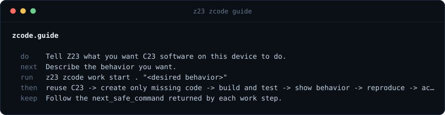

# C23 Commons quickstart

This is the installed-node path for publishing and using an ordinary C23
static-library package without GitHub or a central registry. Start with the
live guide; it states the currently proven target and any missing authority:

```bash
z23 zcode guide
z23 zcode package guide
```

The rule throughout is **verify, don't trust**. A name and semantic version
are labels. The `package_root` is exact identity. An author signature says
only who made one release statement; a provider record says only where bytes
are claimed to be available; a build receipt says only what one exact build
observed. None proves general safety, usefulness, or human acceptance.

The copyable package-store commands below use `/tmp/z23-commons` so an
experiment cannot fall back to the operator's live node datadir. Keep an
isolated datadir, or deliberately replace it with the intended package-host
datadir after completing the preflight.

## The journey

This quickstart is one pass through the whole Z23 journey. Each step below is
a real command; each command returns the next safe one, so you never have to
remember the table.

| Step | Command | Section |
| --- | --- | --- |
| Join the package commons | `z23 join` | [`JOIN.md`](JOIN.md) |
| Describe the behavior you want | `z23 zcode guide` | above |
| Reuse existing C23 first, create only what is missing | `z23 zcode work start -datadir=/tmp/z23-work` | [`work walkthrough`](work/ZCODE_DEVELOPMENT_WALKTHROUGH.md) |
| Build and test it, contained | `z23 zcode work run -datadir=/tmp/z23-work` | [`work walkthrough`](work/ZCODE_DEVELOPMENT_WALKTHROUGH.md) |
| See the real consequence | `z23 zcode work show -datadir=/tmp/z23-work` | [`work walkthrough`](work/ZCODE_DEVELOPMENT_WALKTHROUGH.md) |
| Publish the exact source and release | `z23 zcode create -datadir=/tmp/z23-commons` | [Author](#author) |
| Announce only what this node itself installed and rebuilt byte-identically | `z23 zcode package reproduce -datadir=/tmp/z23-commons` | [Author](#author) |
| Fetch inert bytes on another node | `z23 zcode package fetch -datadir=/tmp/z23-commons` | [Consumer](#consumer) |
| Reproduce it independently | `z23 zcode package source reproduce -datadir=/tmp/z23-commons` | [Reproducer](#reproducer) |
| Accept and use that exact version | `z23 zcode use -datadir=/tmp/z23-commons` | [Consumer](#consumer) |



Acceptance is a human decision about one exact version, taken on your node
under your policy. Nothing in this path requires GitHub, a central registry, or
a particular AI vendor, and the result stays usable when any of them
disappears.

## One-time node preflight

This page assumes a full node that already starts and syncs. If you have not
run one on this machine yet, do
[`GETTING_STARTED.md`](GETTING_STARTED.md) first — in particular the proving
parameters, without which a mainnet node parks during boot and never reaches
the network. `z23 join` below is about the package commons only; joining the
blockchain network itself takes no command at all
([`JOIN.md`](JOIN.md#1-joining-the-blockchain-p2p-network--nothing-to-run)).

The commons network path requires a running full node started with
`-packagehost=1 -buildworker=1`. One command sets that up:

```bash
z23 join
```

`join` writes those flags into your node's own `z23.conf`, adding
`buildworker=1` only when this machine actually has a C23 compiler. It starts,
stops and signals nothing — restart the node yourself with the command it
names. Full details, including the two tiers and how to read the verdict, are
in [`JOIN.md`](JOIN.md).

Then inspect join status and the live DHT:

```bash
z23 zcode package offered -datadir=/tmp/z23-commons
z23 zcode package guide
z23 zcode network status -datadir=/tmp/z23-commons
```

`zcode package offered` reports the shared `join_flags`, `package_hosting`,
`build_worker`, and `joined` fields. Its `live`, `peer_count`, and
`serving_ready` fields distinguish configured hosting from a resident engine
that can exchange packages with at least one eligible NODE_ZCL23 peer. It
names the same join recipe when this process has no live hosting engine.

The swarm tier — hosting and serving package content over ordinary peers —
needs only `-packagehost=1`: no coins, no on-chain identity, no invitation. The
DHT below is a separate, optional upgrade that additionally needs
`-noisetransport` and an active on-chain ZID anchor whose registration spends a
fee. Not having one is not a blocker.

If the DHT is disabled, `zcode network delegate` names the required active,
finalized ZID master input; do not pretend a local key is network admission.
The operator must also allow the package namespace under local policy. Plan
and inspect this once, commit the exact returned token, then restart so the
running DHT loads the policy:

```bash
z23 zcode network policy mutate -datadir=/tmp/z23-commons \
  --input='{"mode":"plan","operation":"add","source":"local","effect":"allow","scope":"service_type","action_mask":63,"value":"zclassic23.package"}'
z23 zcode network policy mutate -datadir=/tmp/z23-commons \
  --input='{"mode":"commit","operation":"add","source":"local","effect":"allow","scope":"service_type","action_mask":63,"value":"zclassic23.package","plan_token":"<returned token>"}'
```

## Author

Put `zcode-package.json`, `LICENSE`, public headers, C sources, and tests in a
directory outside Z23. New original packages default to Apache-2.0 with
`Copyright 2026 Rhett Creighton` on the LICENSE and in each source header.
Other allowlisted permissive licenses stay valid when that is the existing
text. Declare every dependency by its exact `package_root`. Discover any
input spelling with `z23 discover schema <leaf>`.

A package may also ship the program a person runs, not only the library
other code links. Put each program in one translation unit `app/<stem>.c`
that holds `main()`, list it in `files`, and declare it in the manifest:

```json
"programs": ["app/main.c"]
```

Nothing under `app/` is built unless it is declared there — fetched C stays
inert, and the author says what ships. A declared program is compiled with
the package's own flags, linked against the package archive, its locked
dependencies and the declared system libraries, and emitted as the install
output `bin/<stem>` (`bin/<package short name>` for `app/main.c`) under the
same build receipt as the library, so reproduction covers the executable
too. `z23 zcode project init plan` proposes the key when it finds
`app/<stem>.c`; the plan is the reviewed step.

1. Create a package-only key. It is not a wallet or node identity:

   ```bash
   zclassic23-package-sign --generate ./author.key
   ```

2. Derive the exact package, recipe, dependency-lock, API, and signing roots
   without writing to the node:

   ```bash
   z23 zcode package dev prepare -datadir=/tmp/z23-commons \
     --input='{"dir":"/absolute/path/to/package","publisher_pubkey":"<66hex>","publisher_sequence":1}'
   ```

3. Sign the returned `release_signing_digest` while keeping the private key
   off the process arguments, then seal the returned release body:

   ```bash
   exec 7<./author.key
   zclassic23-package-sign --sign-digest <64hex-digest> --key-fd 7
   exec 7<&-

   z23 zcode package dev seal -datadir=/tmp/z23-commons \
     --input='{"release_body_hex":"<prepare value>","signature_hex":"<128hex signature>"}'
   ```

4. Pass the sealed `release_hex` and prepare's `manifest_hex` and
   `recipe_hex` through the same command twice: inspect `mode=plan`, then
   explicitly repeat with `mode=commit`. Commit returns the exact
   `package_root` and transport `transport_root`.

   ```bash
   z23 zcode create --input='{"mode":"plan","release_hex":"<hex>","manifest_hex":"<hex>","recipe_hex":"<hex>","dir":"/absolute/path/to/package","datadir":"/tmp/z23-commons"}'
   z23 zcode create --input='{"mode":"commit","release_hex":"<same>","manifest_hex":"<same>","recipe_hex":"<same>","dir":"/absolute/path/to/package","datadir":"/tmp/z23-commons"}'
   ```

   Commit is local CAS admission, not network publication. The reply
   names `package_root`, `transport_root`, and one copy-paste
   `next_command`: `zcode network publish` in `mode=plan` for a
   `pointer` that already contains those roots. Hold it for one step:
   the pointer is gated on local reproduction evidence first.

5. Admit your own package on the publishing node, then file the distinct
   second build receipt. A `zclassic23.package` POINTER announce is
   refused by name (`REPRODUCTION_NOT_EVIDENCED`) unless this node's own
   store shows two distinct byte-identical installable build receipts for
   the exact package and recipe roots the signed release commits —
   `zcode use` files the first, `zcode package reproduce` rebuilds
   deterministically and files the distinct second:

   ```bash
   z23 zcode use -datadir=/tmp/z23-commons \
     --input='{"name_or_root":"<package_root>"}'
   z23 zcode use -datadir=/tmp/z23-commons \
     --input='{"plan_id":"<returned plan_id>"}'
   z23 zcode package reproduce -datadir=/tmp/z23-commons \
     --input='{"name_or_root":"<package_root>"}'
   ```

6. On the running package-hosting node, publish a POINTER binding
   `package_root` to `transport_root`, then a PROVIDER record for that
   `transport_root`. Each uses `zcode network publish` first with `mode=plan`
   and then `mode=commit` plus its returned `plan_token`. The records are
   signed availability evidence, not correctness evidence.

   ```bash
   z23 zcode network publish -datadir=/tmp/z23-commons \
     --input='{"mode":"plan","kind":"pointer","namespace":"zclassic23.package","semantic_root":"<package_root>","transport_root":"<transport_root>","sequence":1,"not_before":<unix>,"expiry":<unix>}'
   z23 zcode network publish -datadir=/tmp/z23-commons \
     --input='{"mode":"commit","kind":"pointer","namespace":"zclassic23.package","semantic_root":"<same package_root>","transport_root":"<same transport_root>","sequence":1,"not_before":<same>,"expiry":<same>,"plan_token":"<returned token>"}'

   z23 zcode network publish -datadir=/tmp/z23-commons \
     --input='{"mode":"plan","kind":"provider","namespace":"zclassic23.package","transport_root":"<transport_root>","sequence":1,"not_before":<unix>,"expiry":<unix>}'
   z23 zcode network publish -datadir=/tmp/z23-commons \
     --input='{"mode":"commit","kind":"provider","namespace":"zclassic23.package","transport_root":"<same transport_root>","sequence":1,"not_before":<same>,"expiry":<same>,"plan_token":"<returned token>"}'
   ```

   Publication is a renewal contract, not a one-shot. Omit `sequence` (or
   send `0`) on every plan after the first: the node derives `max+1` for the
   stream under its own lock, which is what keeps two operators renewing one
   stream through one node from minting the same sequence and conflicting
   both records into unusability. A commit for a stream the node already
   announces replaces that stream's renewal intention in place — the intent
   table holds one slot per stream, sixteen streams per node, and a
   seventeenth distinct stream is refused `no free publication slot`. The
   node re-signs each held record on its own schedule before expiry and the
   intentions survive restarts, so renewal is normally hands-off; `zcode
   network status` reports how many intents are live.

## Consumer

A name is only a local label. Exact identity remains `package_root`. There is
no global remote name search today and no central tracker; `zcode package
search` searches releases already verified in the local store. This avoids
turning a name index into central technical truth.

Browse the local shelf first. `zcode package library` lists complete packages
this node can seed and names one next command. Every row also carries the
local reproduction evidence for that package (`reproduction.reproduced` /
`publishable` — the same receipts scan the pointer publish gate applies),
with `evaluated_count` / `reproduced_count` census counters on the reply.
`zcode package offered` lists
what connected peers are seeding this session that you can fetch. When a
persisted release in the rebuildable index names a root, that `name` is
enough to fetch without copying 64 hex by hand:

```bash
z23 zcode package library -datadir=/tmp/z23-commons
z23 zcode package offered -datadir=/tmp/z23-commons
z23 zcode package fetch -datadir=/tmp/z23-commons \
  --input='{"name":"<library name>"}'
```

If both `name` and `root` are supplied they must identify the same 32-byte
root. Unknown local names fail closed. A name here is not ZNAM and is not a
network-wide lookup.

Packages that are not yet on this node still need the author's exact
`package_root` through any channel. Discovery on the wire is peer inventory: a
NEW_USER may learn unique *new* roots up to the serving-set size (64) per
hour. Keep-alive of a root already heard is inventory, not flood. A node that
imported and pinned a carrier re-announces that same root — that is how a
later peer still fetches the exact C23 Apache-2.0 bytes after the original
publisher disappears. The swarm net hop proves that for both the Arena
shelf and an ordinary catalog (`zhex`, `zstr`, `zbuf`, `zsha256`, `zring`,
`zmap`, `zvec`, `zutf8`, `zjson`). Verify the `package_root`;
do not trust the announcer.

1. Discover the signed POINTER for the exact root, then fetch its returned
   `transport_root`. Fetch is resumable and inert: it does not build, link, or
   execute downloaded code.

   ```bash
   z23 zcode network records -datadir=/tmp/z23-commons \
     --input='{"kind":"pointer","namespace":"zclassic23.package","semantic_root":"<package_root>","include_evidence_wires":true}'

   z23 zcode package fetch -datadir=/tmp/z23-commons \
     --input='{"root":"<transport_root>","namespace":"zclassic23.package","maximum_bytes":268435456}'
   ```

   Repeat the identical fetch after the asynchronous transfer completes; a
   successful import reports `reconstructed=true` and the exact
   `package_root`. Repetition resumes or reuses verified bytes.

2. Inspect the imported release and its exact dependencies:

   ```bash
   z23 zcode package show -datadir=/tmp/z23-commons \
     --input='{"root":"<package_root>"}'
   ```

3. Build and test only after local approval. First inspect the exact lock and
   build order, then commit the returned `plan_id`:

   ```bash
   z23 zcode use --input='{"name_or_root":"<package_root>","datadir":"/tmp/z23-commons"}'
   z23 zcode use --input='{"plan_id":"<plan_id>","datadir":"/tmp/z23-commons"}'
   ```

The installed result is public headers plus a static archive and, for a
package that declares `programs`, the executables under
`<datadir>/zcode/installed/<package_root>/bin/`. The commit reply lists them
as `programs` and, when there is one, its `next_action` is the exact
`run <path>` to type. Z23 does not load or run any of it inside the node;
running the program, or linking your own application against the archive,
remains an explicit local action.

## Reproducer

Repeat the consumer's exact-root `zcode use` plan and commit on a separately
installed full node. Compare the package root, dependency lock, declared
target/profile, build receipt, and every artifact root. Then inspect locally
filed observations:

```bash
z23 zcode work toolchain
z23 zcode package verify --input='{"root":"<package_root>","datadir":"/tmp/z23-commons"}'
```

`zcode package verify` evaluates the attestations filed in the local store.
Attestations are portable signed wires: when another machine's verifier
produced one, file it with `zcode package attest import
--input='{"attestation_wire":"<hex>"}'`. Filing validates only the wire and
its signature — it is not acceptance; the local approved-verifier quorum
policy applies at evaluation.

`zcode work toolchain` reports this node's `capsule_root`, whether
`zclassic23-package-verify` sits next to the binary (`verifier_present` /
`can_prove`), whether this process has joined independent compile work
(`package_hosting` / `build_worker` / `joined`), the copy-paste `join_flags`
(`-packagehost=1 -buildworker=1`), and a named `blocker` (`NONE`,
`VERIFIER_MISSING`, or `NOT_JOINED`). `z23 join` writes those flags for you;
see [`JOIN.md`](JOIN.md). Independent compile evidence needs the same capsule on the
requester and the proving worker, and the confined verifier next to the worker.
A mismatch is evidence and must remain visible; never pick one result because
it arrived first or came from a preferred signer. Signed asynchronous worker
receipts currently bind candidate action IDs, while released-package
reproduction uses exact local build receipts. A direct signed-worker request
bound to a released `package_root` is not yet exposed, and the live guide says
so rather than claiming it exists.

## Portability

Package source identity is architecture-neutral. Build receipts deliberately
bind their compiler, toolchain evidence, and the exact flags that establish
the target. The currently proven package target is `linux-x86_64`: package
objects force the original AMD64/SSE2 baseline with generic tuning, so AVX,
AVX2, FMA, and BMI are not requirements. Other architectures must produce
their own exact receipts and are not yet claimed. Z23 itself has the
same original-x86-64 CPU floor in its portable release path, built with
ordinary GCC/Clang against a glibc 2.31 sysroot. Zig is not required.

The permanent clean-prefix scenario reruns this lifecycle with installed
binaries, four interchangeable full nodes, an outside-tree two-dependency
package, inert fetch, explicit builds, updates, exact revert, publisher
disappearance, and independent observations: `make
c23-commons-installed-acceptance` from a source checkout.
