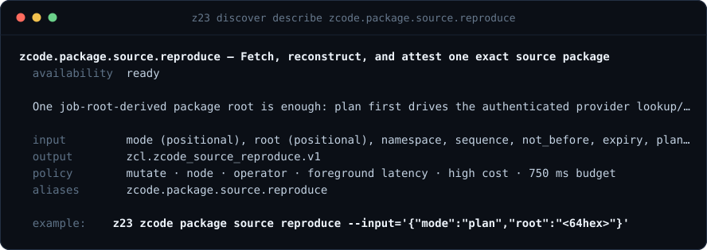

# Z23 Native Command Interface

Status: frozen v1 contract; implementation in progress
Audience: LLM coding agents, application developers, node operators, and UI
adapters

This document is the grammar/tree/envelope contract. For every leaf the
registry currently declares, see [`docs/API_REFERENCE.md`](./API_REFERENCE.md)
(generated from `engine/composition/commands/` by `tools/gen_api_reference.c`; regenerate
with `make docs-api-reference`). For the practical field-by-field
reference of the implemented agent surface (`agentops`, `agentdiagnose`,
`healthcheck`, `agentlanes`, the service/operation catalog, and more), see
[`docs/AGENT_API.md`](./AGENT_API.md).

## 1. North star

> **Z23 is a metaverse where people and AI create real things together,
> and nobody owns the world they build in.**

The primary interface to Z23 is one shallow, searchable command tree
owned by the C binary. An LLM loads only the branch needed for its current
task. It never has to ingest a flat catalog of 100+ tools.

The same tree serves a person, an AI agent, a local automation tool, and every
UI adapter. The API does not grant different truth or ownership authority based
on the caller. `discover help`, `discover search <query>`, and
`discover schema <leaf>` make each available operation and its exact inputs
self-describing. Canonical roots and signed evidence carry facts across
adapters; websites and local projections do not become parallel authorities.

For public ZCODE work, the intended path is discover, fetch and inspect, create
or select a task, produce a candidate, test/reproduce/review, accept, publish,
attribute, and preserve. A leaf may be advertised as ready only when its command
descriptor and handler exist. Planned patronage and continuity operations stay
labelled planned until their simulation-only validation path is complete.
Public read/build/verify access never requires ZC23, and financial or durable
mutations retain explicit plan/commit boundaries.

For development, the target steady-state interaction is simpler still:

1. The agent edits code.
2. The persistent native dev loop notices and coalesces the save.
3. Z23 classifies the change as Core or App.
4. It runs the smallest mandatory deterministic proof.
5. On explicit owner request, `dev.generation.activate` stages, preflights,
   and transactionally publishes one complete isolated-dev generation.
6. The agent reads one compact verdict only when the cycle is not green.

Automatic whole-generation publication remains contained. The only full-image
dev authority is the explicit native plan/commit leaf; watcher scripts, deploy
scripts, broad test commands, and service commands do not gain publication
authority from an environment switch.

## 2. Architectural law

> Core owns truth. Apps consume capabilities.

| Core | Apps |
|---|---|
| Consensus and validation | Resources and controllers |
| Chain-state mutation | Signed application events |
| Block and transaction primitives | Services, jobs, and projections |
| Wallet keys and cryptography | Wallet requests through an opaque capability |
| P2P wire, peers, and sockets | Capability-scoped application topics |
| Raw storage, reducers, boot, and process ownership | Web, onion, ZNAM, and UI bindings |
| Never hot-swappable | Transactionally hot-swappable after ABI/state proof |

Apps compile against `engine/modules/framework/include/zclassic23/app.h`, not project internals.
The public App ABI intentionally exposes no consensus mutation, raw SQL,
filesystem, socket, private-key, peer-state, boot, or process capability.

## 3. Command grammar

The canonical form is:

```text
z23 [global-options] <branch> [sub-branch ...] [leaf-options]
```

Examples:

```bash
z23 status
z23 core chain block get --height=478544
z23 app invoke names resolve --name=alice
z23 dev app describe social
z23 dev search "ABI mismatch"
```

Normative behavior:

- Invoking a branch returns only that branch and its immediate children.
- Invoking a leaf executes it.
- `help [path]` describes one branch or leaf.
- `search <text>` returns at most five ranked paths.
- Stable machine IDs use dots, for example `core.chain.block.get`; CLI paths
  use spaces. A dotted first token (`z23 core.chain.block.get ...`) is
  accepted as the same invocation — the dispatcher splits it into path
  segments before resolution.
- The parser resolves the longest registered command path. Leaf arguments
  cannot be mistaken for command names.
- Named options are preferred. Positional arguments are reserved for a single
  obvious identifier such as an app ID and remain documented in the schema.
- Every leaf normalizes its arguments to one JSON object. Complex arguments use
  `--input='<object>'` or `--input=-` for stdin; convenient typed flags compile
  to the same object. Unknown keys and out-of-range values are rejected before
  side effects. A handler never parses shell syntax.
- Unknown branches fail with nearby valid paths and one executable next
  action; they never fall through to an unrelated RPC method.

Standard response controls are `--view=summary|normal|full`,
`--max-items=<n>`, `--cursor=<opaque>`, and `--budget-bytes=<n>`. Truncation is
always explicit and returns a cursor plus a structured retrieval command.

Stable process exit codes are:

| Code | Meaning |
|---:|---|
| 0 | Passed or accepted |
| 1 | Executed and failed |
| 2 | Invalid input or unknown command |
| 3 | Blocked by a named precondition |
| 4 | Authentication or capability denied |
| 5 | Transiently unavailable |
| 6 | Internal contract failure |

## 4. Root tree

```text
z23
├── status
├── core
│   ├── status
│   ├── chain
│   ├── sync
│   ├── consensus
│   ├── network
│   ├── wallet
│   ├── storage
│   └── mining
├── app
│   ├── list
│   ├── inspect <id>
│   ├── protocols
│   └── invoke <id> [path...]
├── dev
│   ├── status
│   ├── core
│   ├── app
│   ├── change
│   ├── loop
│   ├── test
│   ├── generation
│   └── diagnose
├── ops
│   ├── health
│   ├── diagnose
│   ├── lanes
│   ├── jobs
│   ├── logs
│   ├── timeline
│   ├── metrics
│   ├── postmortem
│   ├── config
│   └── recovery
└── discover
    ├── help
    ├── search
    ├── describe
    └── schema
```

The root has nine choices: `status`, `core`, `app`, `dev`, `ops`,
`discover`, `code`, `vault`, and `zcode`. `help` and `search` remain
convenience aliases for `discover help` and `discover search`, but are not
extra ontology branches. All other operations live under their owner.

## 5. Core tree

```text
core
├── status
├── chain
│   ├── tip
│   ├── block get
│   ├── transaction get
│   ├── mempool status|list
│   └── wait height|blocker|halt
├── sync
│   ├── status
│   ├── validation
│   ├── blockers
│   └── diagnose
├── consensus
│   ├── report
│   ├── integrity
│   ├── utxo commitment|audit
│   ├── mmb
│   └── block invalidate|reconsider
├── network
│   ├── status
│   ├── peers list|incidents|latency|add
│   └── onion status|health
├── wallet
│   ├── status|balance
│   ├── address new|list|import|export-key
│   ├── utxo list
│   ├── transaction list|get|send
│   ├── shielded address|balance|notes|send
│   ├── backup status|now
│   └── audit|rescan|replay
├── storage
│   ├── stats
│   ├── integrity
│   └── query
└── mining
    ├── status
    └── benchmark
```

Consensus, validation, chain mutation, raw storage, wallet keys, network
ownership, and boot remain Core even when an App requests a bounded service
from them.

## 6. App tree

Every installed App contributes one subtree from its manifest. The Core host
generates discovery, route help, optional transport adapters, and bindings from
that manifest.

```text
app
├── list
├── inspect <id>
├── protocols
└── invoke <id>
    └── <manifest-derived subtree>
```

Installed applications are dynamic children from `apps/<id>/app.def`; they
are not hardcoded forever into the global registry. For example,
`z23 app invoke social` returns only Social's immediate children:

```text
social
├── status
├── profile get|update
├── posts get|publish|reply
├── follows list|add|remove
├── feed get
├── web status
├── onion status
└── znam status
```

The same pattern yields manifest-owned subtrees for explorer, names, messages,
market, swaps, games, and blog without bloating root discovery.

The explorer a node already serves becomes a built-in App using the
same host ABI available to external developers. Local HTTP, clearnet HTTPS,
and embedded onion traffic bind to the same resource/controller functions.
ZNAM can bind a human name to the App's onion, clearnet endpoint, or content
identity.

## 7. Development tree

```text
dev
├── status
├── core
│   ├── boundary
│   └── proof
├── app
│   ├── list
│   ├── describe <app>
│   ├── plan <app> <resource>
│   ├── scaffold <app> <resource>
│   ├── simulate <app> [scenario]
│   ├── inspect <app>
│   └── publish <app>
├── change
│   ├── plan [files...]
│   └── apply [files...]
├── loop
│   ├── ensure
│   ├── status
│   ├── wait
│   ├── events
│   └── stop
├── test
│   ├── plan [files...]
│   ├── run <group>
│   ├── sim [app]
│   ├── replay <seed>
│   └── background status
├── generation
│   ├── current
│   ├── history
│   ├── rollback
│   └── compact
├── hotswap
│   ├── apply
│   └── probe
└── diagnose
    ├── latest
    └── show <failure-id>
```

`dev.hotswap.probe` is verify-only in the CLI's own throwaway process:
`dlopen` + ABI-validate + self-test of a module `.so`, never a commit. A
resident discard-only probe is not safe because ELF constructors run before
manifest admission. `dev.hotswap.apply` forwards to the resident node's
`dev_hotswap_native` RPC and is live on the armed `zcl23-dev` lane — gated by
`-hotswap-activate` + `ZCL_HOTSWAP_ACTIVATE=1` + the exact dev datadir
(canonical hard-refused), re-pointing only the six read-only leaves on
`engine/composition/hotswap_swappable.def`. Full mechanism, ABI, and prerequisites
for disposable probing/publication: `docs/work/HOTSWAP.md`.

The ordinary agent runs `loop ensure` in verify mode once, edits files, then
optionally calls `loop wait` for the next sealed cycle epoch. The persistent loop owns
classification, dependency selection, compilation, proofs, and durable
verification verdicts. `auto`/`apply` watcher modes and `dev.change.apply`
currently refuse before publication; use `dev.change.plan`, the verify watcher,
build targets and simulations instead. The gated swappable-leaf hot-swap
(`make hotswap-try` / `make hotswap-apply`) is the live runtime surface.

`dev.vcs.revert` remains a source-only operation when
`relink_generation=false`. A request with `relink_generation=true` refuses
before the source revert, so it cannot use rollback history as a second runtime
activation authority.

### Rails-like App layout

```text
apps/<app>/
├── app.def
├── models/
├── controllers/
├── services/
├── events/
├── jobs/
├── projections/
├── views/
└── sim/
```

`app.def` declares resources, routes, capabilities, web/onion/ZNAM bindings,
state schema, migrations, P2P topics, and mandatory simulations. `scaffold`
materializes the conventional C slice. Generated code is ordinary C and may be
edited freely.

## 8. Progressive-disclosure responses

### Branch menu

Schema: `zcl.command_menu.v1`

```json
{
  "schema": "zcl.command_menu.v1",
  "path": "dev.app",
  "summary": "Build capability-scoped C applications",
  "registry_digest": "sha256:...",
  "children": [
    {
      "path": "dev.app.describe",
      "summary": "Describe one App manifest",
      "risk": "read",
      "latency": "<10ms"
    }
  ],
  "next": {
    "command": "dev.app.describe",
    "input": {"app_id": "social"}
  }
}
```

Menus contain immediate children only. They omit argument schemas, aliases,
examples, and transport mappings until a leaf is described.

### Leaf description

Before calling anything you can read its exact contract - inputs, output schema,
risk, cost and time budget:



Schema: `zcl.command_spec.v1`

Required fields:

- stable path and one-line summary;
- availability: `ready`, `compat`, or `planned`;
- input JSON Schema;
- output schema ID;
- risk, authority, lane scope, mutation, idempotency, and confirmation policy;
- warm latency class;
- one canonical example;
- required Core/App capabilities.

### Execution result

Schema: `zcl.result.v1`

```json
{
  "schema": "zcl.result.v1",
  "command": "dev.app.simulate",
  "ok": true,
  "status": "passed",
  "request_id": "01...",
  "data_schema": "zcl.dev_app_sim.v1",
  "elapsed_us": 9,
  "budget_ms": 750,
  "elapsed_ms": 0,
  "budget_exceeded": false,
  "data": {},
  "next": [{
    "command": "dev.app.publish",
    "input": {"app_id": "social"},
    "reason": "all mandatory scenarios passed"
  }]
}
```

`status` is one of `passed`, `accepted`, `blocked`, or `failed`. `accepted`
returns a job ID. `blocked` names an external or safety precondition. `failed`
means the command attempted work and failed. `ok` reports whether the requested
operation succeeded; it cannot be true merely because valid JSON was produced.

### Error result

Schema: `zcl.result.v1` with `ok=false` and an `error` object

Errors contain:

- stable code;
- short message;
- bounded evidence;
- whether anything mutated;
- retryability, phase, blockers, and a durable failure artifact ID;
- one primary structured, executable next command and at most two alternatives.

No error returns a prose-only recovery essay or a silent nonzero exit.

## 9. Token and payload budgets

Default compact JSON budgets are part of the interface contract:

| Response | Maximum default payload |
|---|---:|
| Root menu | 1,200 bytes |
| Branch menu | 1,600 bytes |
| Leaf specification | 2,400 bytes |
| Status | 2,048 bytes |
| Error or blocker | 2,048 bytes |
| Ordinary result | 4,096 bytes |
| List page | 8,192 bytes or 20 items |
| Search | 5 matches |

Large results require `--view=full`, `--fields=...`, `--max-items`, and a cursor.
Legacy RPCs that return a top-level array are normalized as
`data.items` plus a typed `data._page`; empty arrays remain valid results.
Default responses omit nulls, defaults, redundant aliases, repeated
descriptions, and transport metadata.

`loop events` and jobs emit JSON Lines. A heartbeat is small and periodic; unchanged
state is not re-emitted.

### Input budgets

Input is bounded per key, not globally. `zcl_command_registry_input_str_max()`
(`engine/modules/kernel/src/command_registry.c`) is the single source of truth: a string
key nobody has ruled on may carry 4,096 characters, and a key that carries a
hex-encoded wire object gets twice that wire's own maximum, so the two can
never disagree.

| Input key | Maximum characters | Derived from |
|---|---:|---|
| `manifest_hex` | 2,097,152 | `2 × VCS_PACKAGE_MANIFEST_MAX_WIRE_BYTES` |
| `recipe_hex` | 524,288 | `2 × VCS_PACKAGE_RECIPE_MAX_WIRE_BYTES` |
| `release_hex` | 2 × the release envelope maximum | `VCS_PACKAGE_RELEASE_MAX_WIRE_BYTES` |
| any other string key | 4,096 | the default — no key is unbounded |

The whole `--input` document is read against
`zcl_command_registry_input_budget_bytes()`, which sums the leaf's own
declared keys and never drops below 16,384 bytes. A leaf that declares only
short keys therefore keeps the small frame it has always had. Over-limit input
is refused before any side effect: `INVALID_INPUT` naming the key, its length,
and its limit for a single oversized value, `BAD_INPUT` naming the leaf's byte
budget for an oversized document.

Linux caps one argv string at 128 KiB, so a document past that size must be
piped in as `--input=-` rather than passed as `--input='{…}'`.

## 10. Output modes

- Non-TTY default: compact JSON.
- TTY default: small tree or readable table.
- `--format=json`: compact JSON regardless of TTY.
- `--format=pretty`: indented JSON.
- `--format=tree`: human tree for menus.
- `--format=jsonl`: streams only.
- `--quiet`: data only when a stable leaf payload makes that unambiguous.

Machine status and errors go to stdout as one valid JSON value. Diagnostic
process logs go to bounded artifacts and are referenced, not dumped into the
LLM context.

## 11. Search and context focus

`search` uses registry-owned names, summaries, aliases, tags, synonyms,
capabilities, error codes, and keywords. It is local and deterministic; it does
not call a model or the network. Results are ranked and include the bounded
reason each path matched.

Search results contain only path, one-line match reason, risk, and latency.
An LLM then asks `help <path>` for the selected leaf. This preserves context
focus and makes command discovery reproducible.

Each major branch lives in its own declarative C definition file so an agent
working on Apps does not need to load Core operations:

```text
engine/composition/commands/root.def
engine/composition/commands/core.def
engine/composition/commands/apps.def
engine/composition/commands/dev.def
engine/composition/commands/ops.def
```

Menus and command specifications carry a registry digest. An LLM may cache a
branch and skip rediscovery while that digest is unchanged.

## 12. Registry as the single source of truth

Every command is declared once. Registry metadata is typed, not free-form:
canonical ID and version, aliases, summary, tags/synonyms, input/output schema
IDs, layer, effect, authority, availability and reason, handler, allowed lanes,
required capabilities, deterministic/reversible/idempotent flags,
confirmation policy, sync/job/stream mode, latency class, cost/rate class,
transport bindings, and deprecation replacement.

Effect and cost are independent: a read-only SQL query or replay can be
expensive, while a local App-state write may be cheap.

A declaration is equivalent to:

```c
ZCL_COMMAND(
    "app.names.resolve",
    names_resolve_handler,
    "Resolve a ZNAM name",
    "zcl.names.resolve.input.v1",
    "zcl.names.resolve.result.v1",
    ZCL_LAYER_APP,
    ZCL_EFFECT_READ,
    ZCL_AUTH_PUBLIC,
    ZCL_MODE_SYNC,
    ZCL_LATENCY_FAST,
    ZCL_CAP_ZNAM,
    "name,znam,resolve,address,onion")
```

The registry generates or validates:

- native CLI dispatch;
- shallow menus and search;
- leaf input schemas;
- human help;
- REST/OpenAPI bindings where permitted;
- compatibility aliases;
- documentation and contract tests.

Business logic never lives in a CLI or REST adapter. Both call
the same typed C handler.

## 13. Risk and authority

Every leaf declares:

- risk: `read`, `app-write`, `wallet`, `core-recovery`, `destructive`, or
  `dev-mutation`;
- scope: `local`, `node`, `dev-lane`, or `offline-copy` — `offline-copy`
  leaves take an explicit `--datadir=<path>` and open that datadir's SQLite
  stores directly (no node contact, no RPC), so they answer for a STOPPED
  or COPIED datadir: `core.storage.query.offline` (a SELECT-only query
  against `--datadir`'s `node.db`) and `core.sync.frontier.offline` (H* —
  the L0 reducer frontier fold — against `--datadir`'s consensus.db/
  progress.kv). Both are implemented in
  `tools/command/native_offline_query.c`;
- authority: `public`, `operator`, or `owner`;
- allowed lanes;
- whether it is idempotent;
- whether it supports dry-run;
- confirmation policy.

Externally visible mutations require an idempotency key. Reusing the same key
and normalized input returns the original result; reusing it with different
input is a conflict. High-risk commands use a plan/commit handshake: the plan
returns an expiring intent ID and effect digest bound to the exact target,
arguments, generation, lane, and optimistic preconditions such as tip hash or
state version. Commit requires both values. A changed target invalidates the
intent. There is no generic `--force` or English `yes` confirmation.

Successful mutations return an effect ID and, when reversible, a rollback ID.

### Agent spend grants (`ZCL_AGENT_SESSION`)

An operator can mint a bounded spend grant (`vault.session.create`) and hand it
to an agent, which presents it per-invocation as `ZCL_AGENT_SESSION`. Every
dispatch then carries an `authority` block naming `policy: bounded | exempt`,
the redacted grant, and what it debited. While a grant is presented the
dispatch gates **default-deny the money surface**: the leaves the policy
understands are capped (per-tx, rolling window, recipient allowlist) and
everything else touching the wallet capability — key export, wallet backup, key
import, and the grant surface itself — is refused outright. Full contract:
[`docs/work/agent-spend-policy-design.md`](./work/agent-spend-policy-design.md).

**This is a bound, not a sandbox.** The grant lives in the agent's own
environment, so the same agent can run with it unset and be the unbounded local
operator; and it holds the datadir, so it can call `sendtoaddress` over
JSON-RPC below the kernel entirely. Confining an agent is an OS-level job — a
separate uid without read access to the RPC cookie, or a wrapper binary that
injects the grant and refuses to exec anything else. What this layer gives you
is the bound a cooperating agent runs under, plus an auditable record of what it
did.

Local development commands are never registered as node RPC or REST
methods. Remote input cannot gain authority over a checkout, compiler, test
runner, generation loader, or service manager.

## 14. Jobs and long-running work

Work expected to exceed roughly 500 ms, or unable to satisfy its declared
foreground latency class, supports asynchronous execution and returns
`accepted` with a job ID. It is managed through:

```text
ops jobs list
ops jobs status <id>
ops jobs wait <id>
ops jobs events <id>
ops jobs log <id>
ops jobs cancel <id>
```

Jobs persist source/build identity, seed, arguments, lane, progress marker,
failure capsule, and next action. Polling a job never restarts it.

Streams are NDJSON only: an initial hello names schema, cursor, and heartbeat;
ordered events carry sequence and kind; a terminal event closes the stream.
`--after=<seq>` resumes. Lost history emits an explicit gap event. Backpressure
is bounded, and compiler/test logs never mix with protocol stdout.

## 15. Agent transport

The typed native command registry is the sole local agent and operator
interface. REST remains a read-only public view for web clients.

## 16. Compatibility

Existing native commands and RPC methods become aliases pointing
to registry command IDs. They do not retain duplicate handlers or schemas.

Compatibility responses include a bounded `canonical_path` and deprecation
phase. Aliases remain until callers and docs migrate, then are removed in a
versioned release. Consensus and wallet semantics never change as a side effect
of interface migration.

## 17. Development cycle contract

The target native dev state machine is:

```text
debounce -> classify -> prove -> build -> publish/activate -> verify -> record
```

Phase-0 stops after the build/proof verdict. Publication/activation is
hard-contained until an immutable source snapshot, complete proof receipts, a
resident compare-and-swap on the expected epoch, durable acceptance, and exact
rollback are one transaction. A newer save supersedes an older candidate.

### Golden LLM edit loop

```bash
# Idempotent session/bootstrap call.
z23-dev dev loop ensure \
  --input='{"root":"/home/you/github/zclassic23"}'

# The LLM now edits any number of C files directly.

# Optional synchronization when it needs the verdict before continuing.
z23-dev dev loop wait \
  --input='{"after_epoch":41,"timeout_ms":30000}' --view=summary
```

`ensure` returns watcher ID, registry digest, and baseline source identity. `wait`
returns exactly one bounded cycle verdict for a newer monotonic cycle epoch. On failure, the
agent follows the structured `dev.diagnose.show` command using the returned
failure ID. It never chooses a Make or shell command.

The current negative-receipt boundary is deliberately narrow: only a
deterministic compile-rung diagnostic may be coalesced, and only when the exact
source bytes, ABA mutation token, compiler/linker/search-root epoch, flags, and
proof phase match. Tests, lint, timeouts, signals, lock/infrastructure errors,
and malformed receipts always execute. `dev.diagnose.latest` returns the ID and
one-line summary for the most recently recorded compiler failure; it is not
current-cycle authority and may remain after an edit or green verdict. Follow
the current cycle's returned ID with
`z23-dev dev diagnose show <failure_id>`. The default normal view omits
the capsule and stays below 2 KiB; `--view=full` adds the bounded capsule and
retry command within the 6 KiB command budget. The ID binds source identity,
phase, and normalized first error; first mutation/execution fields describe the
first observation, and the repeat count includes executed and coalesced
observations. `z23-dev dev ff` always executes the current checkout's
ladder. It is a fresh retry, not an exact historical replay.

Cycle verdicts live under
`$HOME/.local/state/zclassic23-dev/workspaces/<workspace-id>/native-cycle.json`
as an embedded `zcl.dev_cycle.v1` inside a workspace-bound, SHA3-sealed
`zcl.dev_cycle_record.v1`. Immutable failure bases and bounded,
SHA3-sealed atomic observation counters use the same workspace directory.
Readers reject schema, ownership, inode, and digest
violations; agents must never edit or delete these files to affect a verdict.

Ordinary App development requires at most one binary call after an edit batch;
when the agent does not need to synchronize immediately, it requires none.

App foreground path:

1. validate public App ABI and capability manifest;
2. run the generic generation/network proof;
3. run App-declared deterministic scenarios;
4. build an immutable content-addressed generation;
5. load, validate, stage, self-test, quiesce, and atomically commit;
6. verify the declared route/protocol probes;
7. asynchronously build the converged immutable binary.

Core foreground path:

1. compile exact affected objects;
2. run mandatory mapped proof, including real-history canaries for consensus;
3. preflight an immutable binary generation;
4. transactionally activate only the isolated dev lane;
5. verify exact executable identity and readiness;
6. restore verified last-good on failure.

Full lint, sanitizers, exhaustive tests, replay, reproducibility, and soak run
as background or pre-push authorities unless an impact rule marks one
foreground-mandatory.

## 18. Social reference acceptance scenario

`dev app simulate social` must prove, with a recorded seed:

- one relay can refuse Alice's valid post without suppressing alternate
  propagation;
- honest peers converge after a partition heals;
- a peer joining after publication catches up through anti-entropy;
- invalid signatures never enter honest projections;
- the same seed produces an identical transcript.

The simulation is RAM-only and belongs in the millisecond foreground path.

## 19. Migration plan

### Phase A — Freeze the contract

- Review this tree, naming rules, envelopes, token budgets, and Core/App law.
- Add golden registry/menu/schema tests.
- Mark every leaf `ready`, `compat`, or `planned`; menus never imply an
  unavailable command works.

Exit: the root and branch trees are stable enough that later work adds leaves
without renaming the grammar.

### Phase B — Native registry and discovery

**Status (read `engine/composition/commands/*.def` and `engine/composition/src/command_catalog.c`
directly): partially landed.**

- **Done:** the split `engine/composition/commands/*.def` registry exists —
  `root.def`, `core.def`, `apps.def`, `ops.def`, and `dev.def`.
  `engine/composition/src/command_catalog.c` `#include`s `root.def` + `core.def` +
  `apps.def` + `ops.def`, expands them via the `ZCL_COMMAND_*` X-macros into
  one immutable `g_catalog_commands[]` table, and binds native handler
  pointers. This is wired to real dispatch:
  `tools/command/native_command.c` calls `zcl_command_catalog()`, and
  `engine/entry/main.c` reaches it through `zcl_native_command_main()` for any
  method `zcl_native_command_is_root()` recognizes. `status` and the
  read-only Core/operator commands in `core.def` are among the first
  mapped leaves.
- **Done:** `dev.def`'s leaves are bound in
  `command_catalog.c` through `ZCL_COMMAND_DEV_READ` /
  `ZCL_COMMAND_DEV_COMMAND` — each declarative leaf maps to a real handler
  in the dev build (`tools/command/native_dev_command.c`, `ZCL_DEV_BUILD`)
  and an honest `ZCL_COMMAND_COMPAT` stub with a `compat_target` in the
  release build. The legacy checkout-local devloop dispatcher is deleted
  from `engine/entry/main.c`; `tools/dev/devloop_menu.c` is a thin wrapper over
  `zcl_command_registry_menu_json`/`_search_json`;
  `tools/lint/check_release_no_dev_symbols.sh` proves via `nm` that the
  release binary links no dev-mutation executors.
- **Live on the dev lane (swappable leaves + owner-gated generation activation):**
  Tier-1 in-process hot-swap has a native `native.leaves` provider, and the
  single-leaf module path is live on the armed `zcl23-dev` lane:
  `dev.hotswap.probe` verifies a module `.so` in a throwaway CLI process, and
  `dev.hotswap.apply` re-points one allowlisted read-only leaf
  (`engine/composition/hotswap_swappable.def`) in the running dev node — gated on
  `-hotswap-activate` + `ZCL_HOTSWAP_ACTIVATE=1` + the exact dev datadir,
  canonical refused. `dev.generation.activate` is the separate full-image
  transaction: immutable staging, exact source/resident CAS, bounded expiry,
  exact-process probe, and rollback. See `docs/work/HOTSWAP.md`.

Exit: an LLM can find and run every read-only operation through native
discovery. **Met for the registry surface** — every declared root
(`status`, core, apps, ops, dev) resolves through the catalog before the
RPC fallback; remaining gap is coverage breadth (not every RPC
operation has a registry leaf yet), not routing.

### Phase C — Native development plane

- Complete `dev loop ensure/wait/events`, native process execution, durable
  verdicts, resumable source epochs, supersession, and generation compaction.
- Port compile/link plans and transactional activation out of shell scripts.
- Make scripts compatibility aliases only, then delete them from the default
  workflow.

Exit: editing code is the only ordinary agent action.

### Phase D — Public App platform

- Finalize the Core host capability table and App manifest ABI.
- Enforce App-only include/link boundaries.
- Add native scaffold, resource, migration, binding, simulation, and publish
  handlers.
- Convert the explorer into the first built-in App without privileged hooks.

Exit: an external developer can build a web/onion/ZNAM App using only the
public SDK.

### Phase E — Social reference App

- Materialize profiles, posts, follows, feeds, signed events, projections, and
  web views.
- Bind the same resources to clearnet, onion, and ZNAM.
- Implement partition, censorship, late-join, invalid-signature, migration,
  and replay scenarios.

Exit: one save can simulate and atomically publish a social App generation.

### Phase F — Runtime Apps and mutations

- Move names, messages, market, swaps, games, blog, and explorer operations
  into manifest-derived `app invoke <id>` subtrees.
- Map wallet and recovery writes with idempotency and confirmation digests.
- Add jobs for long-running work.

Exit: the native tree covers the complete product surface.

### Phase G — Generated public views and cleanup

- Generate REST views from the registry.
- Remove duplicate adapter logic and stale command documentation.
- Measure command-discovery tokens and save-to-verdict latency.

Exit: native is authoritative, public views are mechanically derived, and
default LLM context contains only the selected branch.

## 20. Required proof

- Root/branch menus stay within their byte budgets.
- The root exposes no more than six choices and Apps are dynamic children.
- Search returns no more than five deterministic matches.
- Every ready leaf has one handler, input schema, result schema, risk policy,
  and golden help test.
- Discovery never advertises a ready command that cannot dispatch.
- Every command uses the common result envelope and stable exit-code mapping.
- Every error has a stable code and one executable next action.
- Compatibility aliases call the canonical handler.
- Plan/commit and idempotency conflicts are fail-closed and replay-safe.
- Apps cannot include or link Core-private headers/symbols.
- Release builds contain no dev mutation or loader command path.
- A failed App generation publishes nothing.
- In-flight calls finish on their original generation.
- A failed Core activation restores and verifies last-good.
- Canonical and soak lanes are unreachable from the native dev loop.
- Ordinary App development needs at most one binary call after an edit batch.
- The social reference simulation proves censorship bypass and deterministic
  replay within the foreground latency budget.

## 21. Current prototype and gaps

The registry engine (`engine/modules/kernel/{include/kernel/command_registry.h,src/command_registry.c}`),
the composition-root catalog (`engine/composition/src/command_catalog.c`), and the
`root`/`core`/`apps`/`ops`/`dev` `.def` definitions under `engine/composition/commands/`
are wired end to end — this superseded an earlier dev-only prototype
described in older revisions of this section. Typed effect/authority/
availability/schema/execution-mode metadata, the common result envelope, the
stable exit-code policy, and ranked search are all live. Do not re-propose any
of that; verify current per-leaf `ready`/`planned`/`compat` status with
`z23 discover describe <path>` or [`docs/API_REFERENCE.md`](./API_REFERENCE.md)
rather than trusting a hand-maintained gap list here, which goes stale the
moment a leaf ships.

Genuinely still open, cross-checked against the live `planned` rows: native
job/stream infrastructure (`dev.loop.events`, `core.chain.wait.*`,
`ops.jobs.list`), the confirmation/plan-commit handshake for owner-gated
mutations (`core.wallet.transaction.send`, `core.consensus.block.invalidate`,
and siblings), and wiring App generation loading to the public App ABI
(`dev.app.publish`, `dev.app.inspect`). Automatic runtime generation
publication stays contained: `dev.change.apply`, publication watcher modes,
and generation-relinking revert refuse before mutation. The live runtime paths
on the armed dev lane are the gated single-leaf hot-swap
(`dev.hotswap.apply` / `make hotswap-apply`) and the explicit owner-gated
`dev.generation.activate` plan/commit transaction.

## 22. Migration inventory baseline

The interface vocabulary is split across native agent contracts, full-profile
RPC methods, service entries, service operations, and numerous Make or script
development targets. Enumerate the live counts with `z23 discover
help`/`discover search` rather than trusting a pinned number here — this
baseline describes the inventory shape, not the future public shape.

Canonical migration mapping:

| Current surface | Canonical owner |
|---|---|
| status, health, sync, chain, net, wallet RPC methods | `status` or `core` |
| names, messages, files, market, swaps, tokens, games, explorer | dynamic `app` subtree |
| state, logs, timeline, SQL, metrics, lanes, postmortem | `ops` |
| build, impact, tests, watcher, hot-swap, generations, deploy | `dev` |
| API/tool/service/protocol catalogs | `discover` or `app protocols` |
| raw RPC escape hatch | compatibility alias, never primary discovery |

The migration gate fails when an existing callable route has no canonical ID,
two aliases collide, or transport-local safety metadata disagrees with the
canonical effect and authority policy.

## 23. CLI UX contract (implemented, frozen surface)

Unlike the migration plan above, this section describes what the CLI does
**today** (wf/operator-ux). It is the frozen shape future commands must
follow — the concrete answer to "98% fewer IO tokens between an operator/AI
and the node" than the ~15 KB `core.status` JSON.

**Brief line.** `z23 status` prints exactly ONE line, <=200 bytes,
stable `key=value` pairs separated by single spaces, no JSON braces:

```
hstar=3176325 gap=0 peer_best=3176325 sync=synced blocker=none blocker_age=unknown conditions=0 peers=8 rss_mb=512
```

Fields (frozen names, always present, `unknown` when the underlying RPC
didn't answer — never a fabricated zero): `hstar` (the provable tip, same
value `getblockcount` serves), `gap` (validated header tip minus `hstar`),
`peer_best` (max peer-advertised height, untrusted hint), `sync` (the sync
state machine's state), `blocker` (the headline blocker/gate id — may be a
posture gate that outranks the registry, `none` when nothing is blocked),
`blocker_age` (seconds, suffixed `s`), `conditions` (active self-heal
condition count), `peers` (connected peer count), `rss_mb` (node RSS). All
nine are read from ONE flat JSON body (`core.status.brief` /
`zcl_native_status_brief_body`) — the field selector below reads the same
body; there is no second data path.

Two further fields appear **when the node exports the typed-blocker-registry
summary** (omitted, never zero-fabricated, on older nodes): `blockers` (count
of active typed blockers) and `blocker_head` (the registry's dominant blocker
id). Both come from the **same authority** as `z23 dumpstate blocker`
(`blocker_snapshot_all` + `blocker_select_dominant`), so the compact brief and
`dumpstate blocker` can never name disjoint blockers even when the headline
`blocker=` is a higher-priority posture gate.

Four more fields surface the node's **trust tier** — the operational-vs-
sovereign split (`controllers/sovereignty_controller.h`) — again omitted
(never fabricated) on a node that predates them: `tier` (`bare` |
`release_assisted` | `sovereign`), `install_height` (the snapshot/checkpoint
height the node started from, if any), `verified_height` (how far the
background full-history validation walk has independently confirmed forward
from `install_height`), and `capabilities_locked` (a comma-joined subset of
`mint`, `wallet_spend`, `export_bundle` currently denied by that tier — empty
when nothing is locked). These come from the `agent` RPC's OPTIONAL
`trust_tier` sub-object (schema `zcl.trust_tier.v1`) and `security_posture`'s
own heights, so `z23 status` and `z23 dumpstate sovereignty`
can never disagree on the trust posture.

**Field selector.** `z23 status field=<k1,k2,...>` and
`z23 dumpstate <subsystem> field=<k1,k2,...>` print ONLY the named
fields, one `key=value` line each, in the order requested:

```
$ z23 status field=gap,primary_blocker
gap=0
primary_blocker=none

$ z23 dumpstate reducer_frontier field=hstar,served_floor
hstar=3176325
served_floor=3176325
```

`status field=...` selects out of the same flat real-money journey body as its
one-line render (including `node_healthy`, `synced`, `wallet_ready`,
`can_receive`, `can_send`, `spendable_zat`, `pending_zat`, `reserved_zat`,
`error_code`, and `next_action`). `core status brief field=...` selects the
chain-only fields (`hstar`, `header_height`, `gap`, `peer_best`, `sync_state`,
`serving`, `healthy`, `peer_count`, `primary_blocker`, `blocker_age_s`,
`active_conditions`, `rss_mb`, `tip_advance_age_seconds`).
`dumpstate <subsystem> field=...` selects out of
that subsystem's own `.state` object (whatever top-level keys that subsystem
publishes — see `dumpstate <subsystem>` with no `field=` to see them all).
An unknown field name is a typed error (below) naming the bad field and up
to 12 known field names; nothing is printed on partial failure. `field=` also
works as a normal dashed flag (`--field=a,b`) on any native registry leaf.

**Terse by construction.** `status` always uses the bounded money-journey
body. Its default one-line render is at most 320 bytes and ends with the exact
`next_action`; control whitespace is collapsed so an action cannot inject a
second output line. An unexpectedly oversized action is never rendered as a
partial command; the line directs the operator to `z23 status --format=json`
instead. `--format=json` returns the same fields in `zcl.result.v1`.
When a typed node blocker owns the verdict, `next_action` is
`z23 core sync blockers` — inspect the named blocker. It does not send the
agent into snapshot surgery, and `review_required_*` posture sets
`owner_review_required` so agents do not treat inspection as permission to
mutate the live datadir. `z23 ops snapshot` remains the composite diagnostic
when an operator asked for it.
The strict chain-only
brief is `z23 core status brief`; the large diagnostic document is explicit as
`z23 core status --format=json`.
`ZCL_BRIEF=1` remains only as a compatibility formatting option for raw
`dumpstate` output.

**No-arg entry point.** Bare `z23` (zero arguments — the real node
service never invokes the binary this way; `platform/deploy/zclassic23.service`
always passes `-datadir=`/`-rpcport=`/etc.) prints the brief line plus one
suggested next command, never a wall of text:

```
$ z23
node=healthy synced=yes wallet=ready receive=yes send=no spendable_zat=0 pending_zat=0 reserved_zat=0 blocker=NO_SPENDABLE_BALANCE
next: z23 core wallet address new
```

The next-command hint is deterministic: a named dominant blocker wins
(`z23 explain blockers`), else a positive gap wins
(`z23 explain sync`), else `z23 ops health`.

**Unknown-command diagnostic.** An unrecognized top-level command (confirmed
by the RPC layer, not a version-skew symptom) prints one typed error line
plus up to 3 "did you mean" suggestions from the existing command-search
index (`discover search`'s own scoring — no new fuzzy matcher) when the
index has a hit:

```
$ z23 statuss
error=UNKNOWN_COMMAND detail=no such command 'statuss' try=z23 discover search statuss
did you mean: core.status core.status.brief ops.state
```

**Error contract.** Every error line this contract introduces follows:

```
error=<ID> detail=<human-readable reason> try=<a concrete next command>
```

`UNKNOWN_COMMAND` (unrecognized top-level command), `UNKNOWN_FIELD`
(`field=` named a key that doesn't exist), `CONNECT_REFUSED`/`CONNECT_TIMEOUT`/
`CONNECT_FAILED`/`RESPONSE_TIMEOUT`/`AUTH_REJECTED` (§25, the raw-RPC
connection taxonomy), and `BAD_FLAG`/`UNKNOWN_PATH` (the pre-existing
registry JSON error envelope, unchanged) are the codes in use. Exit codes
follow the existing contract (§13/`enum zcl_command_exit`): `0` ok, `1`
failed, `2` invalid input (unknown command/field), `3` blocked
(`CONNECT_REFUSED` — nothing listening / no cookie), `4` denied
(`AUTH_REJECTED` — wrong cookie for that port), `5` transient
(`CONNECT_TIMEOUT`/`RESPONSE_TIMEOUT` — node busy).

Implementation: `zcl_native_status_brief_render`,
`zcl_native_status_brief_next_command`, `zcl_native_render_field_selection`,
and `zcl_native_render_unknown_command` (`tools/command/native_command.c`) —
one implementation each, called from both the native registry path
(`status`, `--field=`) and the raw-RPC CLI path (`dumpstate ...
field=`, the no-arg entry point, unrecognized commands in `engine/entry/main.c`).

## 25. Auth auto-discovery + connection error taxonomy (E4)

`-datadir=` and `-rpcport=` each default independently (`~/.zclassic-c23`
and `18232`). Passing `-rpcport=<N>` alone without cookie auto-discovery is
ambiguous: the CLI would read the cookie from the *default* datadir and
send it to whatever is actually listening on `<N>` — either nothing
(`Cannot connect`) or a different node (an indistinguishable
`Error: Unauthorized`), with no way for a script to tell those two outages
apart.

**Cookie auto-discovery.** Every node records its bound RPC port next to
its cookie at `<datadir>/.rpcport` (`rpc_http_start`,
`engine/modules/rpc/src/httpserver.c`). When `-rpcport=<N>` is given WITHOUT
`-datadir=`, the CLI scans `<HOME>/.zclassic-c23*` (client-side only, no
network change) for the one sibling datadir whose recorded port is `<N>`
and a readable `.cookie`, uses that datadir, and names it on one loud
stderr line:

```
$ z23 -rpcport=39072 dumpstate reducer_frontier
z23: -rpcport=39072 given without -datadir — auto-discovered datadir /home/op/.zclassic-c23-work (pass -datadir=DIR to target a different instance)
```

An explicit `-datadir=` always wins — auto-discovery only runs when the
operator did not name one.

**Connection error taxonomy.** The raw-RPC CLI path (`dumpstate`,
`getblockcount`, any pass-through method) distinguishes three failure
shapes, each on its own `error=<ID> detail=... try=...` line (§ above) and
its own exit code, rather than one generic message:

| Shape | error ID | exit | Meaning / remedy |
|---|---|---:|---|
| nothing listens at the port (or no `.cookie` at all) | `CONNECT_REFUSED` | 3 | node not running at PORT — start it or point at the right one |
| TCP connects but the node never answers within 10s | `CONNECT_TIMEOUT` / `RESPONSE_TIMEOUT` | 5 | node busy — retry, or check `ops state --subsystem=supervisor` |
| TCP connects, HTTP 401 | `AUTH_REJECTED` | 4 | auth cookie mismatch — pass `-datadir=DIR` for the node actually on that port |

**`status` with no live default node.** The bare `z23 status`
command, with no `-datadir=` and no cookie at the resolved default datadir,
prints a `zcl.cli_local_instances.v1` JSON document listing every sibling
`~/.zclassic-c23*` instance this scan found (datadir, recorded port, and a
bounded live/dead TCP probe) instead of a bare failure — one command answers
"what nodes exist on this host", with exit code `5` (transient — the
*default* target has nothing running, but this is not a dead end).

## 26. Terminal human presentation layer (wf/terminal-ux)

The canonical typed-JSON contract above is unchanged — this section
describes a presentation layer that sits strictly AFTER it
(`tools/command/cli_render.c`, wired at the print sites in
`tools/command/native_command.c` and `engine/entry/main_cli_modes.c`). The rule is:
**machines get canonical JSON, humans get beauty.** The canonical document
is always computed first, byte-identical; only the final print swaps in a
human rendering, and only when a human is watching.

**Activation.** Human rendering is on when `isatty(stdout)`, unless
overridden: `ZCL_HUMAN=1` (also `true`/`yes`/`on`) forces it even on a pipe
— this is the deterministic test hook, there is no `--human` flag —
`ZCL_HUMAN=0` forces JSON even on a TTY, and a parsed `--format=json`
always wins. A pipe without `ZCL_HUMAN=1` therefore emits exactly the bytes
it always did (asserted by `test_cli_render` against the real binary).
ANSI emphasis (bold/dim/red/green) is suppressed by `NO_COLOR` (any value,
even empty) and `TERM=dumb`; layout is unchanged either way, and no ANSI
ever appears on a non-TTY.

**What renders.** Dispatch is on the document's own `schema`, so anything
unrecognized falls through to the canonical JSON:

- `zcl.command_menu.v1` (branch menus, `discover help`) — an aligned
  PATH/SUMMARY/RISK/AVAIL table plus a `next:` hint;
- `zcl.command_search.v1` (`discover search`) — a match table plus `next:`;
- `zcl.command_spec.v1` (`discover describe`) — kv sections (availability,
  semantics, input/output, policy, aliases, example);
- `zcl.command_schema.v1` (`discover schema`) — kv lines;
- `zcl.state_catalog.v2` (`statecatalog`) — a NAME/COST/KEYS/DESCRIPTION
  table;
- `zcl.result.v1` with `ok=false` (every command error) — an error block:
  `error: <CODE> (<phase>)`, the one-line message, and a `run:` suggestion;
- `zcl.result.v1` with `ok=true` for the tree-render allowlist
  (`ops.state`, `ops.logs`) — a bounded aligned kv tree of `data`;
- the ONE-LINE status brief keeps its frozen bytes and gains ANSI accents
  only (dim keys, sync/blocker tint) on a TTY.

**Bounded everywhere.** Tables cap at 24 rows with an exact
`... (N more, pipe to JSON for full)` footer, every line respects the
terminal width (`TIOCGWINSZ`, else `$COLUMNS`, else 80, clamped 40..240)
with U+2026 truncation, and tree output caps depth and lines with the same
footer. A renderer that does not recognize a shape returns 0 and the
canonical JSON prints instead — human mode degrades to JSON, never the
reverse.

**Error suggestions.** The `run:` line comes from a small curated
code → next-action table in `cli_render.c` (e.g. `MISSING_SUBSYSTEM` →
`run: z23 statecatalog`, `BAD_INPUT` → `discover schema <path>`),
which is the optional suggestion descriptor: codes absent from the table
fall back to the envelope's own `next[0]` rendered as an executable shell
line, then to no hint. `UNKNOWN_COMMAND` always prefers the envelope's
`next[0]` because it carries the operator's real query.
