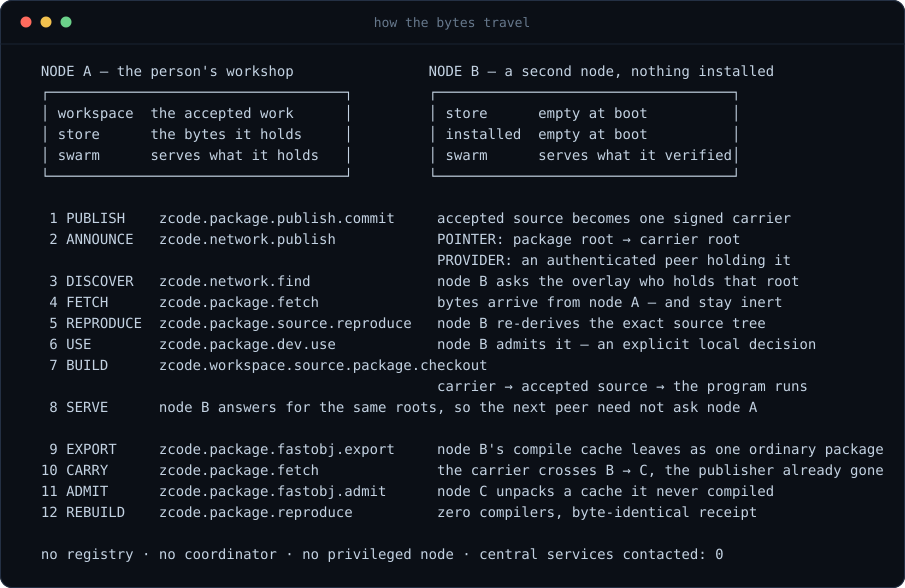

# P2P C23 source hosting

Z23 can host a BitTorrent-like source swarm without changing ZClassic
consensus. The source system is an application protocol: the blockchain may
anchor publisher identity, release roots, payments, or optional burn receipts,
but block and transaction validity remain exactly compatible with `zclassicd`.

## Trust model

The source tree is the authority; transport is not. A release is identified by
the `content.v2` package root from `lib/vcs/package_manifest.*`: canonical
portable paths, regular-file modes, exact sizes, and ordered 1 MiB raw
SHA3-256 chunk hashes. The current root is a flat domain-separated commitment,
not a Merkle tree. A peer therefore fetches the bounded manifest, recomputes the
package root, and only then accepts independently fetched chunks whose exact
position, length, and SHA3 hash match that manifest.

The hash preimage is frozen, not prose-dependent. Both ASCII domains include
their trailing `00` byte: `zcl.package_file.v1\0` and
`zcl.package_manifest.v1\0`. The single-file KAT for path `src/main.c`, mode
`0100644`, and bytes `int main(void) { return 23; }\n` is:

```text
chunk SHA3-256 = e419941e7ce1aec1f09056b33ba2a872e652e2ca05c95702ac60fd18682ce549
file hash      = d1727ca31da57a79f3d85b9f27f271357c07db3e6b890b7c6158cc1c017c1967
package root   = 5f6f1019c07539f6b2a45fe1d88c1b7c7b820c869e6b84776be81c48876615b8
```

Manifest storage and swarm `file_index` both use strict ascending canonical
path order; caller insertion order is never a wire coordinate.

The first network primitive is `lib/vcs/package_swarm.*`. It defines strict
announce, want, data, and cancel frames with request/package binding, canonical
little-endian encoding, a one-chunk-per-frame 1 MiB ceiling, exact-length
parsing, and content.v2 verification. That translation unit is still a pure
codec — no socket, filesystem, wallet, install, build, execution, or
publication authority of its own.

**The subsystem as a whole is socket-wired and has been since slice 12**
(commit 833d7f398). `lib/vcs/src/package_swarm_node.c` is the swarm engine —
the manifest-first, rarest-first, multi-peer scheduler plus serving and
accounting decisions — and `config/src/boot_zcode_swarm_membership.c` puts
its frames on the real P2P wire under the `zpkgswm` message tag via
`p2p_node_begin_message()`. Hosting is **off by default** and enabled with
`-packagehost=1`; the boot glue returns early otherwise, so a default node
neither serves nor pulls package bytes. Operators inspect the live engine
with `z23 dumpstate zcode_swarm`. When hosting is off the dump still
succeeds and reports `enabled`/`present` false; when the engine is wired
it reports peer count, active downloads, bounded per-peer served and
fetched bytes, and the union of roots those peers have ANNOUNCEd, never
keys or datadir paths.
<!-- claim: symbol-present vcs_package_swarm_status_dump_state_json lib/vcs/src/package_swarm_status.c # dumpstate zcode_swarm leaf -->
<!-- claim: symbol-present zcode_swarm app/controllers/include/controllers/diagnostics_dumpers_zcode.def # dumpstate leaf registered -->
<!-- claim: symbol-present vcs_swarm_engine_advertised lib/vcs/src/package_swarm_ads.c # live advertised-root union -->

Read "pure codec" as a statement about the two lower layers only
(`package_swarm.c` and the engine, both of which stay free of sockets, threads,
and wall clock — the caller drives them with explicit ticks), never as "this
subsystem cannot reach the network".

The same `zpkgswm` command also carries dual-signed verified-byte receipts.
`ZSID` advertises a node-local secp256k1 receipt identity (not a wallet key);
`ZSR1` is the frozen 286-byte receipt. Neither is a swarm type: unknown
ANNOUNCE/WANT/DATA/CANCEL values stay malformed. Both endpoints independently
draft the same body from verified served/fetched bytes, sign their role, and
accept only a matching transfer. Receipts are advisory reputation.
Operators inspect receipt identity and settlement with
`z23 dumpstate zcode_swarm_receipts`. When hosting is off or identity is
unavailable the dump still succeeds and reports `enabled`/`present` false
with `settled_peers` 0; when the session is open it reports a short local
pubkey prefix, settled peer count, and bounded per-peer settled and
have_remote flags, never secret keys.
<!-- claim: symbol-present boot_zcode_swarm_receipt_dump_state_json config/src/boot_zcode_swarm_receipt.c # dumpstate zcode_swarm_receipts leaf -->
<!-- claim: symbol-present zcode_swarm_receipts app/controllers/include/controllers/diagnostics_dumpers_zcode.def # dumpstate leaf registered -->
<!-- claim: symbol-present p2p_node_begin_message config/src/boot_zcode_swarm_membership.c # the swarm IS socket-wired -->
<!-- claim: file-present lib/vcs/src/package_swarm_node.c # the transport half exists -->
<!-- claim: symbol-absent socket lib/vcs/src/package_swarm.c # the codec half stays pure -->
<!-- claim: symbol-present packagehost config/src/boot_zcode_swarm.c # hosting stays flag-gated, default off -->
<!-- claim: symbol-present vcs_swarm_receipt_session_open lib/vcs/src/package_swarm_receipt_session.c # receipts ride zpkgswm beside frozen types -->
<!-- claim: symbol-present boot_zcode_swarm_receipt_frame config/src/boot_zcode_swarm_receipt.c # boot glue consumes ZSID/ZSR1 -->


Do not put source packages through the legacy file-market trust path. Its offer
root and possession/payment checks predate `content.v2`, and the fast file
service's public-root-derived stream key is not peer authentication. Useful
quota, worker, backpressure, and PoW mechanics may be generalized later, but a
source swarm needs a fresh authenticated transport and a staging-only CAS.

## Release identity

Each published release should contain:

- the 32-byte `content.v2` package root;
- a human package name and semantic version, both bounded and normalized;
- the publisher's compressed secp256k1 public key and key id;
- a chain id and monotonically increasing publisher sequence;
- optional parent release roots;
- an SPDX license identifier drawn from the frozen v1 allowlist;
- a canonical low-S signature over a SHA3-256 domain-separated release id.

The license field is not advisory. Publish validation rejects any identifier
outside the frozen allowlist - `0BSD`, `MIT`, `Apache-2.0`, `BSD-2-Clause`,
`BSD-3-Clause`, `ISC`, `Zlib` - with unknown, empty and compound expressions all
refused, and separately requires the matching top-level `LICENSE` text inside
the package manifest. The allowlist is exported as the single authority through
`vcs_package_release_license_allowed()`; the reward-eligibility gate and the C23
corpus census both consult it rather than keeping their own copy.

That rule is no longer only a publication-time rule. It is also what an opted-in
host will and will not put on the wire - see **Public hosting admission** below.

The wallet broker signs the release id; private keys never enter an App. A
signature establishes authorship, not safety. Downloaded source remains inert
until a separate explicit inspect/build/install transaction passes policy.

Provider, pointer, storage-ACK, and source-reproduction-ACK DHT records also
expose a canonical `record_root`: SHA3-256 over the complete signed wire under the
`zcl.zcode.dht.record-id.v1\0` domain. It is an immutable evidence coordinate,
not a routing key or possession claim; consumers still parse and verify the
record before using any field. Publication plan/commit replies also return the
bounded lower-case hexadecimal `record_wire`, allowing an asynchronous job to
persist the exact signed bytes and independently reconstruct `record_root`
after restart. Provider discovery does not expose the wire or its delegation;
it remains a compact routing view.

The asynchronous developer publication job records an additive
`PROVIDER_ANNOUNCED` phase only after reloading the signed workspace manifest
and signed package release from ZVCS, deriving the release's `content.v2`
package root, and independently parsing and chain-verifying the exact provider
wire. The wire is stored at `record_root`; the append-only scheduling receipt
binds that root and reports one provider. This step records evidence produced
by the existing DHT owner and grants no network, wallet, or transaction
authority.

After two distinct signed storage witnesses are bound, the publication job
requires one `SOURCE_REPRODUCTION_ACK`. The reproducer starts with the exact
`content.v2` package root, fetches it through the authenticated package route,
re-derives the self-describing source and accepted-work roots, reconstructs the
carrier in fresh private scratch, and verifies the complete accepted-work
authority chain before signing. `zcode package source reproduce` exposes this
as plan/commit: plan returns structured commit input, and commit repeats the
full reconstruction before publishing the one-shot record. The developer
collector rechecks the exact signed wire and requires its node id, master-key
lineage, and declared owner group to differ from the publisher and both
storage witnesses before appending `SOURCE_REPRODUCED` evidence.

That ACK proves exact source-carrier reproduction by a distinct signing
lineage. It is not a byte-identical build receipt, human approval, acceptance,
installation, deployment, wallet or consensus authority. It also reports
`physical_independence_attested=false`: process ids, paths, IP addresses, and
declared owner groups cannot prove that the reproducer ran on another physical
host.

After that P2P phase, `dev publication mirror record` may append one optional
`vcs_devloop_mirror_receipt.v1`. The receipt re-derives the exact ZVCS commit,
source identity, proof, release, workspace and provider roots from the durable
job and may bind an opaque 20- or 32-byte Git object ID. The command does not
run Git, contact GitHub, or call any network/API; its result is explicitly
`recorded_declared`, not independently verified hosting. Missing mirror
evidence is `mirror_pending`, while corrupt or conflicting evidence fails the
status read. Development and P2P publication never depend on this optional
receipt.

## Whole-workspace ZVCS transport

A complete Z23 workspace is larger than the package store's deliberately
conservative 64 MiB per-release admission bound when represented as loose
files. It is therefore carried without weakening that bound by
the `vcs_source_bundle` family
(`lib/vcs/{include/vcs/source_bundle.h,src/source_bundle*.c}`). The explicit
create/verify/import/checkout leaves retain the original bounded v1 monolith.
PROVEN publication uses v2: the canonical ZVCS manifest plus independently
zlib-compressed, stable path-selected shards. This is not another source
identity, VCS, package format, or network transport. The accepted ZVCS tree
root remains authoritative, and the surrounding `content.v2` release
authenticates every manifest and shard byte. Because an edited path stays in
the same shard, a one-file successor changes only its manifest and affected
shard; unchanged shard files keep their existing content.v2 chunks.

The PROVEN `zcode publish plan` path derives the carrier directly from the
human-accepted root. It contains the exact top-level `LICENSE`,
`zclassic23-source/manifest.zvsm`, the nonempty v2 shard files, the signed
`zcode-lane-receipt.v1`, the closed
`zcode-accepted-work-authority.v1` chain, and an inert
`zcode-source-transport.c` marker. The authority bundle contains the exact
task, candidate, proof policy, FRONTIER/CANDIDATE/PROVEN lane receipts, proof
sets, signed work receipts, dependency lock, and task acceptance recipe. It
also carries the five already-pinned upstream archives used by the default
vendor build beneath `vendor/.cache/`; a fresh consumer can rebuild vendor
inputs without GitHub or another source server, and `build_vendor.sh` still
checks their pinned SHA-256 values before use. The signed release commits a
declarative recipe that compiles only the marker; the independently
reverified task acceptance recipe remains bound through the complete carried
authority and is reported separately as `acceptance_recipe_root`.

Carrier construction and checkout both resolve that chain from immutable
objects. Checkout first stages it in an isolated CAS, derives the expected
Ed25519 signer from the candidate (never from a key trusted merely because a
receipt embeds it), verifies every receipt and both proof sets, requires the
`PROVEN` lane, checks task recipe membership against the reconstructed source,
and only then imports authority into the destination workspace. The caller
selects the exact `accepted_work_root`; it does not supply a signer.

Creation reloads and rehashes every blob from ZVCS CAS. Verification
decompresses under fixed manifest/source/wire limits, parses the canonical
path-sorted manifest, rehashes every domain-tagged blob, and re-derives the
expected tree root before any write. Import then deduplicates valid CAS objects
and can atomically repair a corrupt object only at its exact committed address;
the manifest is admitted last. Checkout materializes through the existing
no-follow ZVCS materializer into an existing empty scratch directory. Neither
verify, import, nor checkout executes downloaded source, and none requires
Git.

The typed leaves are `zcode workspace source capture`, the v1 diagnostic
`zcode workspace source bundle create` / `verify` / `import` / `checkout`
set, and `zcode workspace source package checkout` for reconstructing a v2
carrier already fetched into the ordinary node package store. Capture explicitly reports
`accepted:false`: only the existing proof chain and explicit `zcode work
accept` lifecycle can grant PROVEN publication authority.

### Git-free consumer build

A reconstructed carrier is built under two explicit trust inputs: the
human-accepted ZVCS `source_root`, and a bootstrap `z23` binary whose
SHA3-256 came through an already trusted channel. The bootstrap does not grant
acceptance; it only re-derives the complete source root before build admission
and artifact publication. Carrier checkout additionally takes the immutable
`accepted_work_root` and derives its acceptance signer from the carried,
reverified candidate authority.

Module Passports and signed workspace manifests are release-publication
evidence created after the package root exists, so they cannot be bytes inside
the package they name. A no-Git deployment must fetch those separately by
their immutable CAS roots and verify their signatures and package/release
bindings before treating the reconstructed build as the published candidate.

With the carrier checked out into the current empty directory and its five
pinned archives present under `vendor/.cache/`:

```bash
export ZCL_SOVEREIGN_SOURCE_ROOT=<accepted-64-hex-ZVCS-root>
export ZCL_SOVEREIGN_VERIFY_BIN=/trusted/bootstrap/zclassic23
export ZCL_VENDOR_OFFLINE=1
make setup
make -j"$(nproc)"
ZCL_REPRO_REFERENCE_BIN=/trusted/accepted/zclassic23 make repro-verify
```

This mode needs no `.git`, remote, GitHub credentials, or copied fallback
tree. `make setup` skips Git-hook installation. Every vendor cache hit is
checked against the existing pinned SHA-256; a missing or corrupt archive
fails before `curl` or `wget` can run. `repro-verify` creates two additional
Git-free, `.zvcs`-free snapshots, re-derives their ZVCS roots through the
bootstrap, byte-compares their binaries, and—when
`ZCL_REPRO_REFERENCE_BIN` is set—requires both to equal the accepted candidate.
Its success report states `github_contacted=false`.

## Public hosting admission

Hosting is off until `-packagehost=1`, and announcing yourself as a provider on
the overlay is a further, separate step. Once hosting is on, completeness is
still not enough to reach a stranger. The engine classifies every tracked root
against a closed set of shapes (`lib/vcs/include/vcs/package_public_shape.h`)
before it will announce it or answer a WANT for it, and every refusal names the
requirement that failed rather than going quiet:

| shape | what makes it hostable |
| --- | --- |
| package transport carrier | the whole carrier closure is re-derived from the stored bytes with `vcs_package_transport_build()` and must hash back to this exact root: signature verified against the key the envelope names, SPDX identifier on the frozen allowlist, `LICENSE` text present, and release/recipe/inner-manifest bound to each other |
| released package | a persisted envelope names this exact root, verifies, and carries an allowlisted identifier; the manifest carries top-level `LICENSE` |
| ZVCS source bundle | top-level `LICENSE` plus a lane receipt that parses, validates, and verifies against the signer key it names |
| blob | the frozen one-file bytes-only shape, which by contract carries no authorship claim and cannot carry a source tree |
| work context / work output | moved between peers that already accepted each other's signed work frames, and fetched directly from that sender |

Everything else is refused: an incomplete download, a bare manifest with no
release, an inner package root whose envelope never arrived, a carrier whose
closure does not re-derive, and any package shape the node does not recognize.
A verdict is cached per package root and per store mutation generation, so an
envelope arriving after its manifest re-opens the question rather than leaving
the package permanently unhostable.

Two limits, stated rather than implied. The work shapes are admitted on the
strength of the work node's own signed admission, not because they are licensed
content. And the source bundle's full accepted-work authority chain is verified
by the consumer on checkout (`vcs_source_package_reconstruct_verify`), not on
every WANT - proving it means reconstructing the tree.

## Swarm flow

The serving set is a real C23 library shelf, not only the Arena demo. In-tree
`packages/` holds dozens of independent titles; an opted-in host announces
every complete public-serveable root it actually holds, up to the local
announce bound (`VCS_SWARM_MAX_LOCAL_ANNOUNCES`). There is no central tracker
and no Python path.

1. A peer gossips a bounded announcement containing the package root and
   internally feasible manifest/count/size hints. Hints remain untrusted: they
   never reserve storage, earn ratio credit, or establish package identity.
   Unique *new* roots consume the NEW_USER hourly quota; keep-alive of a root
   the peer already heard is inventory, not flood, and does not consume that
   quota. Re-announce of a root this node already holds is how redundancy
   works: a replica that imported and pinned a carrier may advertise the same
   root after the original publisher disappears. The remaining bound is unique
   *new* roots per hour from a NEW_USER, capped at the serving-set size
   (`VCS_SWARM_MAX_LOCAL_ANNOUNCES`).
2. The downloader requests the manifest, parses it, and recomputes the root.
3. A scheduler assigns missing chunks across several peers, with one request id
   per in-flight object, bounded retries, timeouts, per-peer windows, and
   cancellation.
4. Each response is written to a staging CAS only after exact content.v2
   verification. Resume state is a durable bitmap keyed by package root; it is
   derived and can be rebuilt by rehashing the CAS.
5. Completion re-verifies every file and the package root. Nothing is executed.
   The engine then immediately queues ANNOUNCE frames for that exact root to
   every currently known peer that has not already been announced it, still
   gated by public-hosting admission. Completing a fetch does not pin the
   package; operator pin stays explicit.
6. An explicit operator action may inspect, build in containment, test, sign a
   local verdict, and publish/install atomically.
7. Re-serving what you fetched is not automatic. The fetched root must itself
   pass the public-hosting admission above before this node announces it or
   answers a WANT for it.
<!-- claim: symbol-present vcs_swarm_complete_download lib/vcs/src/package_swarm_complete.c # COMPLETE immediately announces -->



HTTPS and onion are transport adapters over the same package/CAS contract;
both are live as of slice 13. Direct P2P rides the node's existing
unauthenticated transport: Noise v2 is deliberately **not** armed under the
swarm, because chunk integrity comes from the content.v2 manifest rather than
from the session. The existing public-UTXO-root-derived file-service key is
not peer authentication and is not used here. Adding an authenticated session
would improve reputation locality — it would not change what a peer can make
you store.

## Attestations ride the same swarm

Third-party verifier attestations move over the flow above with **no new
wire message, no new bound, and no new store**. A canonical `ZCLATT` wire
is at most 681 bytes — under `VCS_BLOB_MAX_BYTES` — so it is admitted as an
ordinary one-file, one-chunk `content.v2` package and served by the same
ANNOUNCE/WANT/DATA codec as any other carrier. Nothing in the swarm engine
knows or needs to know that a particular blob is an attestation.

Discovery is two ordinary signed DHT records in the `zclassic23.attestation`
namespace, and a publisher needs **both**:

- **PROVIDER** on the attestation blob root — "ask me for these bytes".
  This is the record the fetch path actually reads: it builds a
  `{kind:"provider", namespace, transport_root}` selector and routes to
  authenticated peers holding a match.
- **POINTER** binding `semantic_root` = the attested package root to
  `transport_root` = the attestation blob root — "that blob attests this
  package". This is what a puller looks up when all it knows is a package
  root.

They answer different questions and neither substitutes for the other.
Publish only the POINTER and a puller learns which blob to want but finds
nobody serving it; publish only the PROVIDER and the bytes are reachable
but nobody knows to ask for them. Either mistake is a silent no-op at pull
time, so `zcode package attest offer` returns both ready-to-run publish
inputs, provider first.

The operator sequence is three acts, deliberately not collapsed into one:

```text
zcode package attest offer  --input='{"attestation_id":"<64hex>"}'
    -> admits the exact signed bytes into the store, returns
       transport_root plus provider_publish_input and pointer_publish_input
zcode network publish       --input='<provider_publish_input>'   # plan, then commit
zcode network publish       --input='<pointer_publish_input>'    # plan, then commit
```

On the other side, `zcode package attest pull --input='{"package_root":
"<64hex>"}'` resolves every POINTER at that key, drives the ordinary swarm
fetch for each distinct attestation blob, and admits each result. N
independent verifiers are N records at one key, each in its own signed
sequence stream; none can overwrite another. A row that fails stays in the
report naming its rule — one bad or unreachable pointer never aborts the
sweep, because losing the other verifiers' evidence to one bad publisher is
exactly the failure a quorum exists to avoid. The report separates the two
dead ends that must never be merged into a single "not found":
`NO_ATTESTATION_POINTERS` means nobody has attested this root yet (wait for
a verifier), while `ATTESTATION_BYTES_UNREACHABLE` means pointers exist but
no authenticated provider served the bytes (a reachability problem, or a
publisher who skipped the PROVIDER half of `offer`).

**Where the trust actually sits.** The publish-side gate refuses to
advertise a pointer this node cannot stand behind — bytes it does not hold,
bytes that are not a canonical `ZCLATT` wire, a signature that does not
verify, or a wire attesting a different package than the pointer claims.
That check is not read-only and runs on `mode=plan` as well as `commit`: it
re-admits the blob, which files those bytes locally. The write is idempotent
and normally a no-op — `offer` filed them first — and it is consistent with
the claim being made, since publishing the pointer IS asserting this node
holds the attestation. That is hygiene, and it constrains only the node
applying it: a hostile node runs its own build and can publish any pointer
it likes. What protects a
reader is the receiver-side binding check — every admission passes the root
the reader asked about as `expect_package_root`, and an attestation whose
own `package_root` differs is refused `package-root-binding` and never
filed. Do not treat a published attestation pointer as trustworthy because
the publish gate exists.

**Pulling is not accepting.** `pull` files attestations signed by keys this
node has never approved, carrying failure result classes, for packages it
does not hold — on purpose. Refusing evidence at intake would let a node's
own allowlist decide what it is allowed to see, and a quorum you can only
observe when you already agree with it proves nothing. The
approved-verifier quorum is applied afterwards, by `zcode package verify`.

## Ratio and optional ZCL burn credits

The primary ratio should be earned by serving verified bytes:

```text
seed_ratio = verified_bytes_uploaded / max(verified_bytes_downloaded, 1)
```

Peers can grant a small, locally configured bootstrap allowance to new keys.
Receipts are signed by both peers and bind publisher key, package root, byte
count, session nonce, and time window. Receipts are advisory reputation, never
consensus facts, and each node may ignore them.

An optional proof-of-burn boost is technically possible without a fork. A
normal ZClassic transaction can assign value to a provably unspendable
`OP_RETURN` output carrying a new application lokad id, publisher key, package
root, and nonce. A node can verify the transaction against its existing chain
and give the publisher local service credit after a configured confirmation
depth. This does **not** change consensus rules or issuance: the output is
already unspendable under existing ZClassic script behavior and reduces the
spendable supply by that output's value.

Burn credit should be deliberately weak and optional:

- never required to download public source;
- never accepted from mempool-only evidence;
- reorg-aware and bound to an exact output amount and application payload;
- capped or logarithmic so wealth cannot permanently dominate bandwidth;
- used only for queue priority/bootstrap, while seeding earns the durable
  ratio;
- previewed with the exact irreversible ZCL amount and separately confirmed by
  the wallet owner;
- enforced by local peer policy, not block validity, mining, or activation.

No burn transaction builder ships until the payload, signature binding,
confirmation/reorg model, economics, and wallet confirmation UX have independent
review and tests.

## Implementation checklist

- [x] Canonical bounded `content.v2` manifest and SHA3 chunk verification.
- [x] Pure bounded announce/want/data/cancel codec tied to package roots.
- [x] Signed release envelope using wallet-brokered secp256k1 keys.
- [x] Staging-only content-addressed store with quotas and atomic verified puts
  — `lib/vcs/src/package_store.c`, `-packagequota` (default 10 GiB) split over
  frozen pool fractions.
- [x] Durable resume bitmap and multi-peer rarest-first scheduler —
  `lib/vcs/src/package_swarm_node.c`; resume records persist under
  `<zcode_dir>/downloads/<root-hex>` with temp + fsync + atomic rename.
- [x] Peer inventory, backpressure, timeout, retry, and offence accounting —
  same engine: bounded per-peer in-flight, fresh request id per retry,
  tombstoned cancellations, and the slice-11 never-credit offence table.
- [ ] Authenticated direct transport plus HTTPS and onion adapters. *Partly
  done, and the remainder is a deliberate reframe rather than pending work.*
  The HTTPS/onion side shipped in slice 13 (`/zcode*` routes,
  `app/controllers/src/zcode_site_controller.c`). Noise v2 is **not** armed
  under the swarm and is not planned to be: chunk bytes are authenticated
  against the content.v2 manifest before they are ever stored, and the peer's
  33-byte accounting key is an explicitly LOCAL session pseudo-key, not a
  contributor identity claim. What is still open is transport-level peer
  authentication, which today buys reputation locality, not chunk integrity.
- [ ] Dual-signed verified-byte receipts. *Local ratio policy is done* —
  `zcode seed ratio` / `zcode seed status` over the local service book. The
  dual-signed, both-peer-attested receipt is the open half. (`package_reward.*`
  "receipts" are the contributor-reward ledger, a different object; do not
  mistake one for the other.)
- [ ] Optional proof-of-burn parser/indexer and reorg-aware credit projection.
  *Genuinely absent — no burn parser exists in `lib/vcs` or the ZCODE catalog.*
- [x] Explicit build/test/install transaction; downloads never execute.
  `zcode package add plan|commit` is the one lifecycle. It resolves the
  root-pinned dependency DAG, re-derives an expiring plan at commit, invokes
  only `zclassic23-package-verify --emit` under confinement, rehashes emitted
  artifacts, installs atomically, and pins the generation. There is no generic
  downloaded `zcode.install`/shell-script surface, by design.
<!-- claim: symbol-present zcode.package.add.commit config/commands/zcode.def # the explicit lifecycle exists -->
- [ ] End-to-end simulator. *Substantially done, with named gaps.*
  `lib/test/src/test_zcode_swarm_net.c` runs real `zpkgswm` frames between
  independent engines behind real msg_processors (only socket syscalls elided)
  and covers the golden path, malicious wrong-hash chunks, unrequested DATA,
  restart-mid-download resume, disconnect requeue, and the A→B→C hop:
  A publishes the C23 Arena library shelf (`zprng`, `zdogfight`, `zdogdrone`,
  `zdogace`, `zdogview`) and a second ordinary catalog (`zhex`, `zstr`, `zbuf`,
  `zsha256`, `zring`, `zmap`, `zvec`, `zutf8`, `zjson`); B mirrors and pins; A
  disappears; C fetches the exact carriers from B. The in-process engine gate
  (`lib/test/src/test_zcode_swarm.c`) seeds that ordinary shelf and proves
  keep-alive of those roots is inventory, not unique-root flood. Still
  uncovered: reorg.
<!-- claim: file-present lib/test/src/test_zcode_swarm_net.c # the real-wire swarm harness exists -->
<!-- claim: file-present lib/test/src/test_zcode_swarm.c # the in-process engine gate seeds an ordinary C23 shelf -->

The foundations this section once gated on — signed release envelope, staging
CAS, runtime gossip, and explicit build/test/install — have shipped. The
remaining hosting-specific gap above is dual-signed verified-byte receipts.
The active program is now the agentic development network in
[`work/ZCODE_DEVELOPMENT_NETWORK.md`](./work/ZCODE_DEVELOPMENT_NETWORK.md):
canonical task/evidence objects, a real ZBuild executor, and requester-led P2P
work. Proof-of-burn stays last and stays optional.
